# Grafik und Animationen von Captain Commando

Bildschirmaufnahmen aus MAME 0.264 (Set `captcomm`, 384 × 224 Pixel) und
daraus geschnittene Panoramen, Animationsstreifen und Pose-Galerien. Laut
Nutzer liegt für diese Grafiken eine Lizenz bzw. Sondergenehmigung vor, die
auch die öffentliche Verbreitung in diesem Repo abdeckt (Freigabe
2026-10-01, siehe `../notes.md`). ROM-Daten, Sounds und disassemblierter Code
gehören nicht dazu; alle Bilder sind Aufnahmen des laufenden Spiels, keine
aus den ROMs ausgelesenen Grafikdaten.

Alle Bilder lassen sich mit `scripts/grafik/alle.sh` neu erzeugen (etwa
15 Minuten). Die Läufe sind deterministisch.

## Konventionen

- **Positionen und Zeiten** wie in `../notes.md`: 1 Positionseinheit = 1 Pixel,
  Frames bei 59,64 Hz.
- **Bild und Speicher**: Figuren erscheinen im Bild einen Frame nach dem
  Stand im Arbeitsspeicher (gemessen an der Kette von Captain Commando:
  Bildwechsel jeweils einen Frame nach dem Wechsel des Animationszeigers).
  Die Ausschnitte berücksichtigen das; der Hintergrund läuft dagegen
  bildgenau mit der Kamera.
- **Kachelbeschriftung**: `f<n> <d>F` heißt Frame n des Laufs, die
  Animationsstufe dauert d Frames. In den Gegner-Galerien steht statt der
  Dauer die Kennung der Animationsstufe (letzte fünf Stellen des
  Animationszeigers) und der Frame.
- **Eingriffe**: Der Stage-Start wählt die Stage in der Figurenwahl per
  Speicherschreibzugriff (danach läuft das Spiel normal; am Stage-Ende zählt
  es selbst weiter). Der Durchlauf-Bot füllt die LP der Figur auf und setzt
  bei langem Stillstand die LP der Gegner im Bild auf 1. Beides ändert die
  Grafik nicht, aber den Spielverlauf (andere Gegnerwellen als beim
  Spielen ohne Hilfe möglich).
- **Status der Beschreibungen**: Panoramen, Szenen, Streifen und die
  Dauern darin sind eigene Aufnahmen. Die Texte zu Schauplätzen, Gegnern
  und Bossen stammen aus dem Grafik-Workflow (je Stage und Figur ein
  Agent). Ein zweiter Agent hat je Stage und Figur Stichproben nachgemessen
  (129 Angaben, 115 bestätigt); die 14 Korrekturen sind eingearbeitet.

## Dateien

| Ordner | Inhalt |
|---|---|
| `stages/` | je Stage `stage<N>_start.png` (erster spielbarer Moment), sechs Szenenbilder `stage<N>_szene_<k>.png` über die Kamerastrecke verteilt, Panoramen `stage<N>_panorama[_<k>].png` (ein Bild je Abschnitt zwischen Kamerasprüngen) |
| `figuren/` | Animationsstreifen der vier Spielfiguren `<figur>_<bewegung>.png`, Dauern in `ablaeufe.csv` |
| `gegner/` | Pose-Galerien `stage<N>_<typ>.png` je Gegnertyp (Typkennung S+0x38) und Ablaufstreifen von WOOKY und EDDY (`wooky_*`, `eddy_*`, Dauern in `ablaeufe.csv`) |

**Panoramen**: Der Bot spielt die Stage durch; bei jedem Kamerafortschritt
von 32 px entsteht eine Aufnahme. Aus jeder Aufnahme wird der senkrechte
Streifen ab Bildspalte 120 genommen (dort liegt keine Anzeige) und an seine
Weltposition gesetzt; in Stage 5 ab Spalte 228. Folgen:
- Der linke Bildrand des Stage-Anfangs (120 px) und das rechte Ende
  (232 px) fehlen; dafür gibt es die Start- und Szenenbilder.
- Schwarze Flächen liegen dort, wo die Kamera nie hinschaut (Stage 1 und 7
  scrollen auch senkrecht).
- Hintergrundebenen mit Parallaxe passen an den Streifengrenzen nicht
  genau; besonders sichtbar in Stage 7.
- Figuren stehen dort, wo sie bei der Aufnahme waren. In Stage 5
  (automatisch scrollende Hoverboard-Fahrt) bewegen sich Figur und Gegner
  ständig mit und tauchen deshalb oft auf.

**Pose-Galerien**: Ein zweiter Durchlauf nimmt jeden Frame auf und
protokolliert alle Gegner-Slots. Je Gegnertyp und Animationsstufe wird ein
Bild ausgeschnitten, bevorzugt eines, in dem keine andere Figur näher als
70 px steht. Die Kacheln sind nach Animationszeiger sortiert; Stufen
derselben Animation liegen dadurch meist nebeneinander. Höchstens 40 Posen
je Typ und Stage. Bosse (ab 72 Max-LP) haben größere Kacheln.

## Stages

Konventionen: px = Pixel; Frames bei 59,64 Hz; Kamera-x = linker Bildrand in Welt-x; Tiefe = Tiefenkoordinate des Fußpunkts; LP = Lebenspunkte. „Anzeige-Max“ ist der vom Spiel geführte Max-LP-Wert; bei starken Gegnern steht dort 72, der Überschuss erscheint als zusätzliche Balkenschichten im HUD. Animationen: „8×4“ = 8 Schritte zu je 4 Frames, „5/3/3“ = Einzeldauern in Frames. In allen Analyse-Läufen wurden die Spieler-LP laufend aufgefüllt; Bot-Dauern enthalten zusätzlich die je Stage genannten Eingriffe.

Die Texte je Stage stammen aus dem Grafik-Workflow. Ein zweiter Agent hat je Stage 6 bis 9 Angaben nachgemessen; die dabei korrigierten Werte sind eingearbeitet und mit „Gegenprüfung“ markiert, alles Übrige ist ungeprüft. Bilder, Panoramen und Galerien sind eigene Aufnahmen.

Zwei Hinweise gelten für alle Stages:
- Die LP eines Gegners hängen nicht nur vom Typ ab, sondern vom Rang beim Erscheinen (Schwierigkeitswert, steigt mit der Spielzeit; siehe `../notes.md`, „Nachtrag: Schaden der Gegner“). Deshalb nennen die Tabellen mehrere Werte je Typ, und eine Stage, die direkt angewählt wird (niedriger Rang), hat schwächere Gegner als eine, die man durchgespielt erreicht.
- „Max-LP“ ist der Wert S+0x9A. Bei normalen Gegnern sind das die LP beim Erscheinen. Bei Bossen und dem Roboter steht dort 72 (Skala des Lebensbalkens); ihre tatsächlichen LP stehen im Text.

| Stage | Name | Panorama-Abschnitte | Gegner-Galerien |
|---|---|---|---|
| 1 | CITY | 1 | 5 |
| 2 | MUSEUM | 2 | 5 |
| 3 | NINJA HOUSE | 3 | 11 |
| 4 | CIRCUS CAMP | 4 | 4 |
| 5 | SEA PORT | 5 | 4 |
| 6 | AQUARIUM | 2 | 8 |
| 7 | UNDERGROUND BASE | 3 | 10 |
| 8 | ENEMY'S SPACESHIP | 2 | 9 |
| 9 | CALLISTO | 2 | 7 |

## Stage 1: CITY

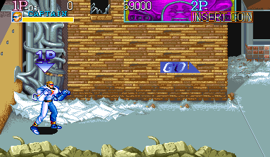

Szenen (über die Kamerastrecke verteilt, zuletzt Bossarena bzw. Stage-Ende):

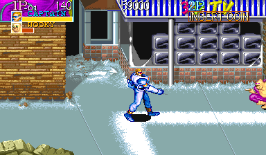 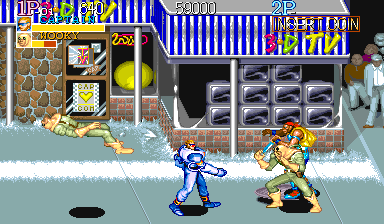 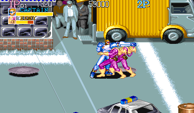 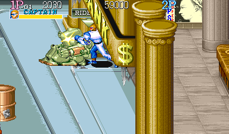 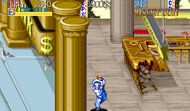 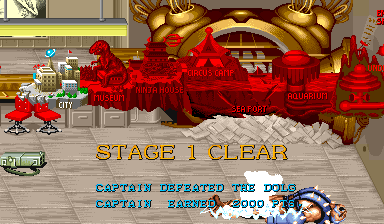

Panorama:

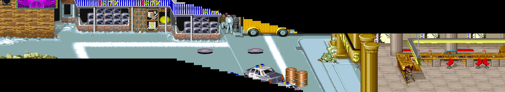

### Schauplatz

Metro City bei Nacht bzw. im Winter, sechs Bereiche von links nach rechts. Die Straße ist kalt grau-blau, die Bank warm gold und beige. (1) Hinterhof (Kamera-x 256 bis ca. 450): große hellbraune Ziegelwand mit gezacktem schwarzem Loch oben, graue Rohre links, magentafarbener Plakatrahmen mit lila Gesicht, Zeitungspapier und Schnee am Mauerfuß. (2) Einkaufsstraße (ca. 450–1000): TV-Laden mit blau-weiß gestreifter Markise, „3-D TV“-Logo und Schaufenster voller gestapelter Fernseher; Steinfassade mit Plakaten („CAP COM“-Herz, gelbe Lampe, Graffiti), Matsch auf dem Pflaster. (3) Abschüssige Straße (ca. 900–1400): Das Bild scrollt nach rechts unten. Hinten ein gelber Wellblech-Lkw mit statischer Zuschauermenge in grauen Anzügen und Hüten, auf der Fahrbahn Gullydeckel; aus zweien (x 1152, x 1344) klettern Gegner. Vorn links ein Polizeiwagen und zwei Kupfer-Ölfässer.

(4) Platz vor der Bank (ca. 1400–1700): blassblaues Pflaster, Fassade mit goldenen korinthischen Säulen, senkrechtem „BANK“-Schriftzug, großem goldenem „$“ und Glastüren; ein grüner Mech bricht durch die Glastür. (5) Bankhalle (ca. 1700–2048): Marmorboden, graue Säulen, großes Porträt, Schreibtische, langer Holzschalter mit Goldrand und roten Drehstühlen; ein diagonal zertrümmertes Schalterstück ragt in den Raum. (6) Tresorraum/Bossarena (2048–2176): riesige offene Goldtresortür mit Banknotenbündeln, davor Geldhaufen und drei silberne Geldkassetten, aus denen DOLG bricht. Vor den Figuren liegen der Sandsack-/Schuttstreifen am unteren Rand des Hinterhofs, der schwarz-weiße Polizeiwagen mit rot-blauem Lichtbalken (Welt-x ca. 1280–1470) und die goldenen Säulen der Bankfassade (Welt-x ca. 1750–1815). Abschluss: „STAGE 1 CLEAR“, „CAPTAIN DEFEATED THE DOLG“, „CAPTAIN EARNED 2000 PTS“, dann rote Weltkarte.

### Kennwerte

| Größe | Wert |
|---|---|
| Länge | Kamera-x 256–2176 (1920 px Scroll), sichtbar Welt-x ca. 256–2560. Kamera-x 2169–2182 in elf Frames ist kein Überschießen, sondern ein waagrechtes Bildschütteln (±2 bis ±7 px), wenn DOLG die Figur wirft (Gegenprüfung) |
| Vertikales Scrollen | Ja: Kamera-y 256 bis Kamera-x 896, dann linear 1 px pro 4 px Kamera-x (896→256, 1152→192, 1409→128), danach 128 bis zum Ende; Explosionen wackeln +2 px |
| Kamerasperren/Arenen | Vor dem Boss keine; Scrollen nur nach rechts, Spieler wird bei Bildschirm-x 200 gehalten, linker Rand wirkt als Wand. Bossarena ab Kamera-x 2048: Folgepunkt bei Bildschirm-x 256, Totzone 128–256, Kamera-x 2124–2182; Arena wird nicht erzwungen |
| Begehbarer Tiefenbereich | Untergrenze überall der Bildrand (Füße y 224). Obergrenze: x 320–ca. 600 Tiefe 341 (Band 75); x ca. 608–1000 Tiefe 357 (Band 91); Hang und Platz x ca. 1088–1600 Tiefe 325 (Platz 187 Einheiten tief); Bankeingang x ca. 1700–1740 Tiefe 261; Bankhalle/Tresor x ≥ 1728 Tiefe 229 (Band 91 px). Fest: Polizeiwagen, Ölfässer, Schaltertresen (diagonale Wand ab Tiefe ca. 186; darunter oder per Sprung passierbar). Gehen x 1,75, Tiefe ca. 0,95 px/Frame |
| Scroll-Ebenen und Parallaxe | Keine Parallaxe, alle Grafiken 1:1 in x und y. Vor den Figuren: Sandsackstreifen, Polizeiwagen (auch fest), Bank-Säulen. HUD fest |
| Objekte | Glasscheiben (HP 1): Bankglastür (15 Scherben, wenn der Mech durchbricht), zwei weitere in TV-Schaufenstern (nicht zerbrochen). Zwei Ölfässer „DRUMCAN“ (zwei eigene Objekte, HP-Wert 777, fest; jedes gibt einen Gegenstand frei, Gegenstände steigen auf etwa 35 px Höhe): Brathähnchen (heilt voll, 20→72) und ein Raketenwerfer („MISSILE“, Name nicht bestätigt). Drei Geldkassetten (von DOLG zerschlagen): 2× MISSILE, 1× LASER. Waffen der DICKs fallen als Pickups. Items liegen ca. 700 Frames, blinken 91, gesamt ca. 840. Fahrzeug: Mech (nach Abwurf des Fahrers „RIDE ON“). Keine Gefahren |
| Dauer | Reines Gehen ca. 1097 Frames ≈ 18,4 s. Bot: Kamera-x 2176 bei Frame 4357 (inkl. 1266 Frames am Tresen), Boss besiegt bei 6047, Stagewechsel bei 6587 (110 s) |

### Gegner

| Gegner (HUD-Name) | Typ S+0x38 | Max-LP | Aussehen | Auftreten | Animationen (Frames × Dauer) |
|---|---|---|---|---|---|
| WOOKY | 0x0005A97E | 16 / 24 / 28 | Kahler, gelbhäutiger, gebückter Schläger in olivgrüner Tarnkleidung mit braunem Gürtel und Taschen, hellbraune Stiefel; ca. 67 px hoch, Box mit Schatten ca. 57×73 | 7: einer versteckt am rechten Rand (16), einer hockend vor dem TV-Laden (16), 2 aus Gully x 1152 (24), Mech-Fahrer (24), 2 von links beim Auftritt von DOLG (28) | Gehen 8×4 (1,75 px/Frame); Haltung 3×5; Spott 10/8/8/8/7/1; Gully-Ausstieg 47 (9/9/9/9/5/5/1); Schläge nach Ausholen 21, ca. 58–63 je Schlag (5 LP früh, 8–10 LP später); umgeworfen wird die Figur nur von bestimmten Schlaganimationen, nicht nach einer festen Trefferzahl (Gegenprüfung); Griff mit Knie; Tod ca. 86–90 |
| EDDY | 0x00060CA0 | 30 / 34 / 38 | Kahler, gelbhäutiger, kräftiger Schläger im pink-magentafarbenen Trainingsanzug mit dunkellila Besatz; ca. 66 px hoch, Box ca. 49×71 | 5: hockend vor dem TV-Laden (30), 2 aus Gully x 1344 (34), 2 von links als letzte Bosswelle (38) | Schema wie WOOKY: Gehen 8×4; Haltung 3×5; Gully 47; Schlagkombo nach Ausholen 21, ca. 60 je Schlag (5–9 LP); Sprungknie aus ca. 30 px (9 LP); Tod 4×6 |
| SKIP | 0x00025086 | 34 | Messer-Punk: lange blonde Haare unter rotem Bandana, offene gelbe Jacke, hellblaue gemusterte Strumpfhose, rote Schuhe, Messer; ca. 71 px hoch, Box ca. 62×77 | 1: rennt bei Kamera-x ca. 768 von rechts herein | Rennen 8×4 (2,5 px/Frame); Gehen 8×6 (ca. 1,5 px/Frame; laut Gegenprüfung, nicht 6×6); Messerwirbeln 4×4; Messerhagel 25 + 12 Pause (7–9 LP); Ausfallstich 34 (10 LP); Messerwurf 4/3/1/1/32, Messer 4 px/Frame (10 LP); Aufstehen 27 |
| DICK | 0x00064E7A | 23 / 24 | Schütze in hellblauer Arbeitskleidung, blaue Mütze, blond, gelbe Handschuhe und Stiefel; #1 silberne Pistole, #2 grüner Raketenwerfer; ca. 68 px hoch, Box ca. 65×74 | 2 in der Bossarena von links: #1 nach dem Tod eines Arena-WOOKY, #2 mit der letzten EDDY-Welle | Gehen 8×4 (ca. 1,6 px/Frame); Zielen 60–120; Schuss 5/1/10/1 (17), Salven zu 3 Kugeln, 8 px/Frame, 6 LP; Rakete ca. 5 px/Frame, explodiert; hält Abstand 100–140 px; Tod ca. 90; Waffe wird Pickup |
| MECH (Ride Armor) | 0x0009ADEA | 85 (Anzeige-Max 72) | Olivgrüner zweibeiniger Walker mit orangebraunen Füßen und schweren Armen, WOOKY im offenen Cockpit; ca. 90×105 px | 1: bricht bei Kamera-x 1344 durch die Bank-Glastür | Einbruch 7 + 6×4; Gehen 6×7 (ca. 2 px/Frame); Armschlag ca. 24, Reichweite 87–88 px (12 LP); Griff (15 LP); Zusammensacken 10/10/10; Explosion 40 + 30 mit 20 Trümmern |

Pose-Galerien dieser Stage: [`stage1_025086.png`](gegner/stage1_025086.png) (SKIP), [`stage1_046da4.png`](gegner/stage1_046da4.png) (DOLG (Boss)), [`stage1_05a97e.png`](gegner/stage1_05a97e.png) (WOOKY), [`stage1_060ca0.png`](gegner/stage1_060ca0.png) (EDDY), [`stage1_064e7a.png`](gegner/stage1_064e7a.png) (DICK)

### Boss

DOLG (Typ 0x00046DA4), 100 LP (Anzeige-Max 72); der HUD-Balken wechselt grün → gelb → orange. Riesiger kahler Brutalo mit hellbrauner Haut und schwerem Kinn, blaues Stachel-Panzergeschirr mit Stachel-Schulterplatten, großer blauer mechanischer Arm mit Panzerhandschuh, genietete hellbraune Hose, braune Stiefel; gehend ca. 70 px breit und 97–101 px hoch, Armschwung über 110 px breit. Er erwacht bei Kamera-x 2048, zerschlägt die Geldkassetten und bricht aus dem Tresor; zugleich kommen zwei WOOKY von links. Gehen 5×8 (ca. 1–1,6 px/Frame). Gegen einen passiven Spieler greift er etwa alle 170–200 Frames an: Ansturm (Lauf über 141–205 px, 12–14 LP, bei Kontakt Übergang in den Griff), dreifacher Armschwung (je ca. 38 Frames, Reichweite ca. 77–79 px, 9–10 LP), Sprung-Körperpresse (Scheitel 107–108 px, bis ca. 200 px auf den Helden gezielt, 17–19 LP), Griff mit Wurf (17–19 LP) und kurzer Schlag. Super-Armor: Kombos ohne Niederschlag beendet er mit einem 54-Frame-Stoß (ca. 48 px), danach springen seine LP auf den Wert vor der Kombo zurück; nur Kombos mit Niederschlag zählen. Mit seinem Sturz brechen alle übrigen Gegner im selben Frame zusammen.

### Auffälligkeiten

- Die letzte Welle (2 EDDY, DICK mit Raketenwerfer) kam einen Frame nach dem Eingriff Boss-LP 72→1; ohne Eingriff kam sie in 1500 Frames nicht. Natürlicher Auslöser unbekannt (vermutlich Boss-LP).
- DICK #1 erscheint nur nach dem Tod eines Arena-WOOKY.
- Gegnerschaden steigt im Verlauf (5–6 LP am Anfang, 8–10 LP ab Kamera-x ≥ 1024). Ursache ist der Rang, ein Schwierigkeitswert, der mit der Spielzeit steigt (siehe `../notes.md`, „Nachtrag: Schaden der Gegner“).
- Der Bot hing 1266 Frames am Tresen, weil er in Tiefe ≥ 200 blieb; in Tiefe ≤ ca. 185 geht man vorbei.
- DOLG existiert unsichtbar ab dem ersten Frame der Stage.
- Eingriff im Bot-Lauf: Boss-LP 72→1 bei Frame 5689 (nach 900 Frames ohne Kamerafortschritt).

## Stage 2: MUSEUM

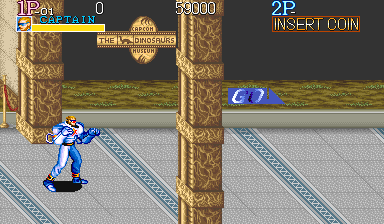

Szenen (über die Kamerastrecke verteilt, zuletzt Bossarena bzw. Stage-Ende):

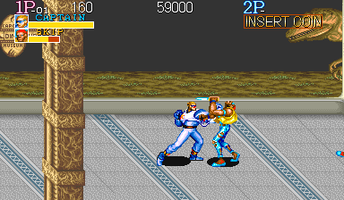 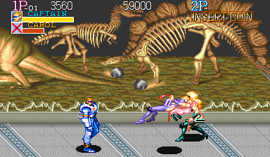 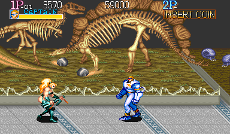 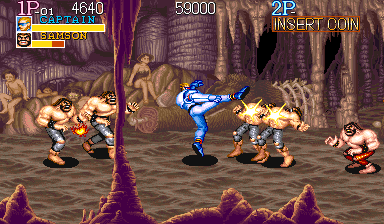 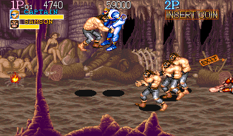 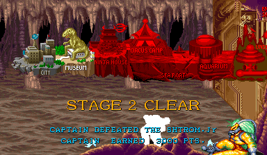

Panorama:

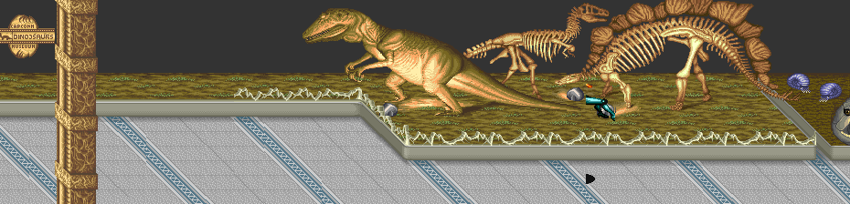

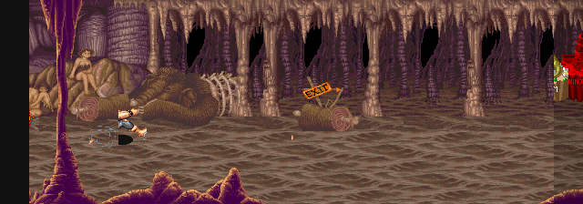

### Schauplatz

„Capcom The Dinosaurs Museum“ in zwei Abschnitten, verbunden durch einen geskripteten Sturz durch ein Bodenloch. Abschnitt A, Museumshalle (Kamera-x 256–1152): dunkle anthrazitgraue Wand mit oliv-khakifarbenem Moos-/Grasstreifen am Fuß, hellgrauer gesprenkelter Terrazzoboden mit diagonalen blau-weißen Musterbändern, ovale Messingtafel „CAPCOM / THE DINOSAURS / MUSEUM“, ganz links eine rote Samtkordel an Messingpfosten. Zwei goldbraune verzierte Marmorsäulen, je ca. 46 px breit: Die zweite (Welt-x ca. 432–479, volle Bildhöhe) steht vor den Figuren; die erste (Welt-x ca. 272–317) steht hinten an der Wand, endet bei Bild-y ca. 138, und die Figuren laufen vor ihr (Gegenprüfung). Dann folgt eine lange erhöhte Ausstellungsplattform (grauer Steinrand, Gras, Felsen) mit einem lebensgroßen T-Rex-/Allosaurus-Modell hinter Glas, einem kleinen Theropodenskelett, einem riesigen Stegosaurus-artigen Skelett, blau-lila Trilobiten/Ammoniten, roten Seelilien und einem riesigen grauen Urfischschädel. Die Vorderkante der Plattform verläuft diagonal (x ca. 767–815). Die Halle endet an einer hellbeigen Wand mit einem dunklen rechteckigen Bodenloch vorn rechts. Stimmung: kühles Grau und Blau, warme Exponate, ruhig.

Nach der letzten Museumswelle springt Captain automatisch ins Loch; schwarzes Bild mit kleinem weißem Stern, dann öffnet eine Stern-Irisblende. Abschnitt B, unterirdische Höhle mit prähistorischem Diorama (Kamera-x 2048–2688): dunkelbraun-mauve, Stalaktiten und Tropfsteinsäulen, schwarze Öffnungen; Höhlenmenschen auf Felsen und eine stehende Frau, ein großer brauner felliger Mammut-Kadaver mit Brustkorb, Holzstämme, Knochen, ein flackerndes Lagerfeuer und ein hölzernes „EXIT“-Pfeilschild. Eine hohe lila Tropfsteinsäule (Welt-x ca. 2223) steht vor den Figuren, ein lila Stalagmitensaum läuft am unteren Rand. Im Bossraum stehen ein Holzfass mit „CAPCOM“ und rechts eine verzierte vergoldete/bronzene Doppeltür (Welt-x ca. 3000) in lila Fels. Abschluss: „STAGE 2 CLEAR / CAPTAIN DEFEATED THE SHTROM.Jr / CAPTAIN EARNED 3000 PTS“, Captain geht automatisch zur Tür.

### Kennwerte

| Größe | Wert |
|---|---|
| Länge | Museum Kamera-x 256–1152 (896 px), Sprung auf 2048 beim Lochsturz, Höhle 2048–2688 (640 px); gesamt 1536 px. Spieler-Bildschirm-x 24–360, Kamera folgt ab Bildschirm-x 200 |
| Vertikales Scrollen | Keines (Kamera-y 0); 4-px-Wackeln nach dem Bosstod |
| Kamerasperren/Arenen | Kamera-x 897: Museumswelle (2 CAROL, BRENDA, 3 SONIE), danach automatische Lochsequenz (202–278 Frames) und Sturz in die Höhle, Kontrolle 56 Frames nach dem Auftauchen. Kamera-x 2432: Höhlenwelle 2 (2 MARBIN, dann ORGANO + 2 SAMSON). Bossarena Kamera-x 2560–2688 (Welt-x 2584–2991). Erste Museumswelle (2 SKIP) und erste Höhlenwelle ohne harte Sperre |
| Begehbarer Tiefenbereich | Museum x ≤ 767: 10–101 (Füße y 224–133); x 767–815: Obergrenze folgt der Plattformdiagonale (Tiefe = 868 − x); x 815–1257: 10–53. Höhle und Arena: 10–85 (Füße y 224–149) |
| Scroll-Ebenen und Parallaxe | Keine Parallaxe, alle Ebenen 1:1. Vor den Figuren: die zweite Eingangssäule und die lila Höhlensäule. HUD fest |
| Objekte | Glasscheibe der T-Rex-Vitrine (HP 1): zerbricht, wenn ein Gegner hineingeschleudert wird (22 Splitter, Exponat bleibt). Fass (HP-Wert 777) neben der Bosstür: Braten auf Teller. Ein Trupp-MARBIN ließ eine goldene Schale fallen (Essen). Keine Waffen-Pickups, Fahrzeuge oder Bodengefahren; das Loch dient nur dem Skriptsturz |
| Dauer | Reines Gehen ca. 1100 Frames ≈ 18,5 s. Bot 8627 Frames (144,7 s), Walker-Lauf 8124 Frames (136,2 s), beide mit LP-Eingriffen. Vom Todesschlag bis Stage 3: 592 Frames |

### Gegner

| Gegner (HUD-Name) | Typ S+0x38 | Max-LP | Aussehen | Auftreten | Animationen (Frames × Dauer) |
|---|---|---|---|---|---|
| SKIP / SONIE | 0x025086 | SKIP 34, SONIE 36 | Messer-Punks, Palettentausch. SKIP: dunkle Haut, lange blonde Mähne, türkiser Overall mit weißem Besatz. SONIE: rotes Bandana, rote Haare, rote ärmellose Jacke, grüne Tarnhose. Box ca. 40–64 × 75–78 | 2 SKIP früh im Museum von rechts (Kamera-x 323/366); 3 SONIE mit der Welle bei Kamera-x 768–897 (2 von rechts, 1 von links) | Einlauf 8×4 (2,5 px/Frame); Gehen 8×6 (ca. 1,5 px/Frame); Kriechen 4×4; Überkopf-Messerhieb 25 + 12, alle 37 Frames (7/8 LP); Ausfallschnitt 33 (10 LP); Messerwurf (10 LP, 4 px/Frame); Niederschlag bis Aufstehen 114–146; Tod 20 Frames blinken |
| CAROL / BRENDA | 0x036FB2 | CAROL 30, BRENDA 60 (55 im Walker-Lauf) | Kämpferinnen mit langen Haaren, Overknee-Stiefeln und lila/rotem Elektro-Schockstab. CAROL: pinke Haare, lila Body. BRENDA: orange-blond, petrolgrünes Outfit. Größte Normalgegner, Box ca. 61–69 × 97 | 2 CAROL ruhen bei x 1136 (eine auf der T-Rex-Plattform), werden bei Kamera-x ca. 705 sichtbar und springen herab; BRENDA bei Kamera-x 768 von rechts | Gehen 8×6 (ca. 2,0 px/Frame); Kontaktschock, Spieler blinkt als Röntgenskelett (13 LP); Hock-Entladung bis ca. 90 px (13 LP, trifft auch Gegner); Flugtritt (Höhe bis 75); Niederschlag bis Aufstehen 83–101; Tod 6 + 19 blinken |
| SAMSON / ORGANO | 0x020C1C | SAMSON 32 (Walker-Lauf 30), ORGANO 52 (Walker-Lauf 50) | Kleine stämmige Glatzköpfe mit schwarzer Banditen-Augenmaske, Bart, nacktem Oberkörper, Armbändern. SAMSON: grau-blaue zerrissene Hose; ORGANO: rot-orange Flammenhose. Box ca. 51–56 × 68–70 | Höhlenwelle 1: ORGANO + 2 SAMSON von rechts, 2 SAMSON von links; Höhlenwelle 2: ORGANO + 2 SAMSON von rechts | Gehen 6×4 (ca. 1,2 px/Frame); Schlag ca. 20 (8 LP); Griff mit Überkopfwurf (12 LP); Hebe-Slam (10 LP); Schlagserie 8×4 (9–10 LP); Niederschlag bis Aufstehen 107–123 |
| MARBIN | 0x029C36 | 48; Boss-Helfer: Anführer 50–56, Trupp 16 | Kahler Buckliger in weißem Hemd und Hose mit braunem Lederwams/Sack auf dem Rücken; speit Feuer. Box ca. 60 × 63 | 2 in Höhlenwelle 2 (je einer links und rechts); vom Boss gerufene Gruppen (1–2 Anführer + 2–7 Truppmitglieder) vom linken Rand | Rennen 6×4 (ca. 2,65 px/Frame, Trupp 3,0); Feueratem, Flamme 52–109 Frames (14 LP), Trupp bildet eine Wand aus 4 Flammen; Sprung-Kopfstoß (10 LP); Griff (12 LP); Trupp geht nach ca. 180–220 Frames ab |

Pose-Galerien dieser Stage: [`stage2_020c1c.png`](gegner/stage2_020c1c.png) (SAMSON / ORGANO), [`stage2_025086.png`](gegner/stage2_025086.png) (SKIP), [`stage2_029c36.png`](gegner/stage2_029c36.png) (MARBIN), [`stage2_036fb2.png`](gegner/stage2_036fb2.png) (CAROL / BRENDA), [`stage2_04bd3c.png`](gegner/stage2_04bd3c.png) (SHTROM.Jr (Boss))

### Boss

SHTROM.Jr (Typ 0x04BD3C), 125 LP in den Analyse-Läufen, 130 im natürlichen Gesamtdurchlauf; HUD-Balken in Schichten (cyan bei 125, grün bei 89, dann gelb auf rot). Großer Mann mit wilder blassgrüner Mähne, Schutzbrille, muskulösem gelb-orangem Panzeranzug, grauer Schulter-/Rückenpanzerung und Stiefeln; trägt ein langes Gewehr mit Bajonett tief vor dem Körper. Box 79–81 × 93–95. Er erscheint bei Kamera-x 2560 an der Tür, hält die Tiefe des Spielers und pendelt zwischen x ca. 2687 und 2815. Gewehrsalve alle ca. 155–466 Frames: Er kniet und feuert 5–7 Kugeln im 10-Frame-Takt, 8 px/Frame, je 14–15 LP mit Niederschlag; die Kugeln treffen auch seine MARBINs. Salto-Sturzflug (23 LP): Hocke, Aufstieg, Kugelrolle in Höhe 52, dann waagrechter Flug mit ca. 4,4 px/Frame. Er ruft MARBIN-Gruppen, im natürlichen Kampf beim LP-Abfall 65→59 und 41→25. Beim Tod wackelt das Bild 4 px, alle übrigen Gegner werden weggeschleudert. Er weicht ständig aus; der Bot brachte ihn in 20000 Frames nur von 125 auf 7.

### Auffälligkeiten

- Max-LP schwanken zwischen Läufen (BRENDA 60/55, ORGANO 52/50, SAMSON 32/30, MARBIN-Anführer 50–56, Boss 125/130); vermutlich dynamische Schwierigkeit.
- Wellenauslöser nicht rein positionsabhängig (SONIE-Trio bei Kamera-x 768 bzw. 897, MARBIN-Paar bei 2163 bzw. 2432).
- Der 900-Frame-Halt bei Kamera-x 610 ist keine Sperre: Der Bot hing an der Plattformecke (x 810, Tiefe 58); in Tiefe ≤ 53 kommt man vorbei.
- Das HUD zeigt verzögert den letzten Gegner, der traf oder getroffen wurde.
- Eingriffe im Bot-Lauf: 3 Gegner auf 1 LP an der Sperre 897, Boss 78→1; die Boss-Beschwörung dort ist nicht natürlich.

## Stage 3: NINJA HOUSE

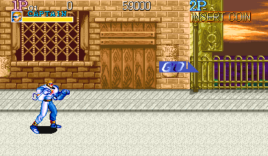

Szenen (über die Kamerastrecke verteilt, zuletzt Bossarena bzw. Stage-Ende):

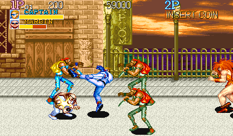 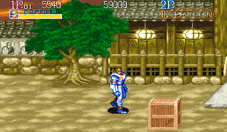 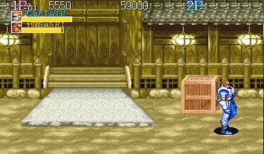 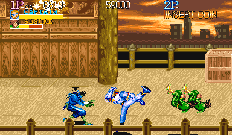 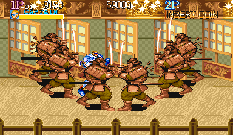 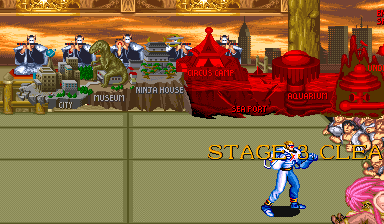

Panorama:

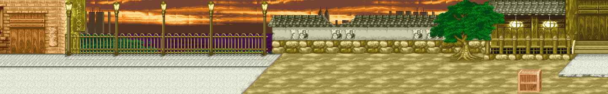

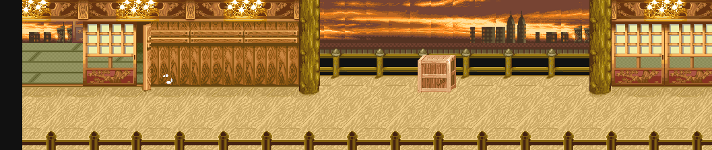

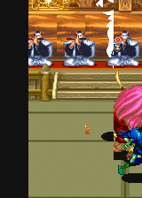

### Schauplatz

Drei Teile, verbunden durch Stern-Irisblenden, durchgehend warme Abendstimmung: orange-braune Wolkenstreifen, Gold und Holzbraun, lila Akzente nur in der Straße. Abschnitt 1 (Kamera-x 256–1665) beginnt als westliche Stadtstraße: links ein hellbraunes Ziegelhaus mit geschnitzter Holz-Doppeltür, Gitterfenster und „JAZZ BAR“-Schildern, ein hohes senkrechtes oliv-goldenes „CAPCOM“-Banner, Gaslaternen auf Messingpfosten vor einem verzierten Messinggeländer, dahinter ein lila Wasserband mit dunkelgrünen Sträuchern und der Abendhimmel mit dunklen Hochhaussilhouetten; Boden aus hellgrauen Platten und Beton. Ab Kamera-x ca. 850 wird der Boden ein sandbeiger Hof und der Zaun eine japanische Mauer (graue Kawara-Ziegel, weißes Putzband mit Steingesichtern, gelber Steinsockel). Bei Welt-x ca. 1470 steht ein großer Baum mit gedrehtem Stamm (hinter den Figuren). Am Ende die Front eines hölzernen japanischen Hauses mit oliv-goldenen Pfosten, leuchtenden Papierlaternen, Holzstufen zur Veranda und weißer Steinplattform; davor zwei Holzkisten „CAPCOM“.

Abschnitt 2 (Kamera-x 2560–3585) ist innen: Halle mit hellen Holzdielen, geschnitzten braunen Wandpaneelen, Shoji-Fenstern über rot-gold bemalten Paneelen, vergoldetem Deckenbalken mit statischen Goldsternen und dicker Rundsäule; Wandpaneele schwingen als Türen auf, Ninjas springen in weißem Rauch heraus. Dann eine offene Veranda mit Holzbalustrade und Skyline; ein vorderes Geländer (Pfosten mit Spitzkappen) läuft am unteren Bildrand vor den Figuren. In der letzten Shoji-Halle umringen sechs gepanzerte Samurai den Helden in einer Zwischensequenz. Bossraum (Kamera-x 4608–4736, Kamera-y 96): Thron-/Dojo-Halle mit olivgrünem Tatami, Podest mit rotem Teppich und fünf maskierten Figuren in schwarz-weißen Roben, Holzbalustrade mit Mitteltreppe, Abendhimmel dahinter; an den Rändern drängen sich kahle, rosa Mönchs-Zuschauer. Yamato springt durch eine weiße Rauchwolke vom Podest. Abschluss: „STAGE 3 CLEAR / CAPTAIN DEFEATED THE YAMATO“.

### Kennwerte

| Größe | Wert |
|---|---|
| Länge | Abschnitt 1 Kamera-x 256–1665 (1409 px, Kulisse Welt-x 256–2049); Schnitt auf Abschnitt 2 Kamera-x 2560–3585 (1025 px); Schnitt auf Bossraum 4608–4736 (128 px, Arena Welt-x 4608–5120) |
| Vertikales Scrollen | Keines; Kamera-y 0 in Abschnitt 1/2, fest 96 im Bossraum; Wackeln ca. 5 px für ca. 20 Frames beim Bosstod |
| Kamerasperren/Arenen | (1) Kamera-x ca. 801–804: Straßenbande. (2) 1665: MUSASHI + 2 KOJIRO, danach Autowalk zu den Stufen. (3) 2849: Tür-Ninja-Welle (4 KOJIRO, 2 HANZO), Freigabe beim Fall des 4. KOJIRO; die folgenden 2 SASUKE sperren nicht. (4) 3585: Auslöser der Samurai-Ring-Sequenz, kein Kampf. (5) Bossarena 4608–4736. Bot-Pausen bei 367 und 452 sind keine Sperren |
| Begehbarer Tiefenbereich | Straße (Kamera-x 256–1024) 10–101; Baum/Mauer (x ca. 1480) 10–85; vor dem Haus (x ≥ 1610) 10–77; Halle (Kamera-x 2560–2817) 10–93; Veranda (3072–3328) 10–117; Bossarena 106–213 (Füße y 224 bis 117, nur aus Bot-Daten) |
| Scroll-Ebenen und Parallaxe | Hauptebene 1,0 (Gebäude, Zaun, Mauer, Haus, Böden, Hallenwände, Veranda, Podest, Tatami). Ferne Ebene (Himmel, Wolken, Skyline) 0,5 in Abschnitt 1 und 2, 1/16 (0,0625) im Bossraum. Vor den Figuren nur das vordere Holzgeländer in Abschnitt 2 (Bildschirm-y ca. 195–224); Baum und Zuschauer liegen dahinter |
| Objekte | Holzkisten „CAPCOM“ (HP-Wert 777): x 1632 (nicht zerbrochen, am Abschnittsende entfernt), x 1960 (zerbrochen, Essen „TENDON“ = Tempura-Reisschale), x 3328 auf der Veranda (nie zerbrochen, Inhalt unbekannt). Verfehlte Shuriken bleiben als Wurfstern-Items liegen (451–783 Frames). Messer von SKIP/SONIE. Keine Gefahren, Fahrzeuge oder Schusswaffen |
| Dauer | Reines Scrollen ca. 1464 Frames (24,5 s) plus Skripte (Ausgang 283, Einlauf 100, Ringsequenz 303, Boss-Intro 189). Bot 12066 Frames (202 s) mit Eingriffen |

### Gegner

| Gegner (HUD-Name) | Typ S+0x38 | Max-LP | Aussehen | Auftreten | Animationen (Frames × Dauer) |
|---|---|---|---|---|---|
| SKIP / SONIE | 0x025086 | 34 (späteres Paar 36) | Gleiches Sprite in zwei Paletten. SKIP: blonder Pferdeschwanz, rotes Stirnband, gelber Schal, nackte Arme, hellblaue zerrissene Jeans. SONIE: rotes Bandana, rote Weste, grüne Tarnhose. Vorgebeugt mit kurzem Messer; Box 58–64 × 75–78 | 6, alle in Abschnitt 1 von rechts (2 SKIP, dann 2 + 2 SONIE) | Gehen 8×6 (ca. 1,2 px/Frame); Einlauf 8×4 (ca. 2,5); Messerwirbeln 4×4; Ausfallstich 5/4/3/2/3/16/1 (7 LP); Messerwurf, Messer 4 px/Frame (10 LP); Flug beim Niederschlag 40–42 (113 px); Aufstehen 27; Benommen 4×5 |
| MARBIN | 0x029C36 | 44 | Schwerer Glatzkopf, Kopf zwischen den Schultern, braune Lederweste über weißem Hemd, weiße Hose, gebückt; Box 47–60 × 59–63 | 1, von links hinter dem Helden | Gehen 6×4 (ca. 1,0 px/Frame); Lachen 2×6; kurzer Schlag 8/3; Hechtkopfstoß 3 + 22 (ca. 130 px); Aufstehen 19 |
| MARDIA | 0x03A2D6 | 85 (Anzeige-Max 72) | Riesige muskulöse Frau mit wilder oranger Mähne, tief ausgeschnittenem orangem Kleid mit Beinschlitz, roten High-Heel-Stiefeln; Box 55–60 × 90–96 | 1, von rechts in der Straße | Gehen 8 Schritte × 7–8 (64er-Zyklus, ca. 1,2 px/Frame); Körperstoß 15 + 4/6/3 + 20 + 1 (49); Aufstehen 25; Benommen 4×5 |
| CAROL | 0x036FB2 | 30 | Lange wehende pinke Haare, lila Trikot, lila Overknee-Stiefel, lila Elektrostab mit rotem Kabel; Box 43–58 × 74–76 | 2, von links in der zweiten Straßenwelle | Gehen 8×6 (ca. 1,1 px/Frame); Elektrostoß 6/6; Sprungknie/-tritt 6/3 (Höhe 41); Tod 6/1 + 19 blinken |
| MUSASHI | 0x02D15C | 60 (Bossraum 55) | Großer Samurai in brauner Lamellenrüstung mit Helm, olivfarbene Hakama, braune Stiefel; Katana hoch erhoben, zweites langes Schwert waagrecht an der Hüfte; mit Klinge 77–84 × 117–124, Hiebposen bis 138–146 breit | 1 vor dem japanischen Haus (von rechts), 1 im Bossraum mit Yamato | Gehen 8×6 (ca. 1,0 px/Frame), zweites Set mit tiefem Schwert; Hiebserie ca. 38 (9 und 13 LP); Stoß im Bossraum 22+16+16 (20–21 LP); Reichweite ca. 90 px; Aufstehen 43 |
| KOJIRO | 0x06C660 | 30 / 32 (Bossraum 34–42) | Ninja im rot-orangen Kapuzenanzug mit Goldbesatz, läuft tief geduckt; Box 60–71 × 60–62, als Saltokugel 46–57 × 37–48 | 2 von links während MUSASHI kämpft; 4 aus den Hallentüren; Verstärkung im Bossraum | Rennen 6×4 (ca. 1,8 px/Frame); Haltung 4×6; Saltoangriff 6×8 (41–49, 120–144 px, Höhe 53–75); Bodenschläge 4/4/4/1 (11 LP gesehen); akrobatisches Aufstehen |
| HANZO | 0x070430 | 28 (Bossraum 30) | Blauer Ninja mit stacheligem schwarzem Haar, grüne Handschuhe und Stiefel; Box 60–71 × 63–68 | 2 aus den Hallentüren; 1 im Bossraum | Rennen 6×4 (ca. 1,25 px/Frame); Sprungtritt 6/6/1 (Höhe 42); Shuriken-Wurf in der Luft 2/2/1/1/2/2, Shuriken gerade 5 px/Frame in Höhe 80 |
| SASUKE | 0x074164 | 38 (Bossraum 40) | Grüner Ninja mit zotteligem braunem Haar und unbedecktem Gesicht; Box 60–71 × 52–62 | 2 auf der Veranda von rechts (ohne Kamerasperre); 1 im Bossraum plus Beschwörungen | Rennen 6×4 (ca. 2 px/Frame); Saltosprung 5×6 + 11 (41, 120 px); Sprung mit Shuriken-Wurf, Shuriken fällt im Bogen in 33 Frames zu Boden und bleibt als Item |
| Samurai-Ring (Zwischensequenz) | 0x06C2B4 | – (nicht bekämpfbar) | Gleiches Sprite wie MUSASHI, Schwerter erhoben | 6 bei Kamera-x 3585, umringen von beiden Seiten den eingefrorenen Helden | Einlauf 7×6 (ca. 119 px), dann Pose 166 Frames bis zur Blende; keine Angriffe |

Pose-Galerien dieser Stage: [`stage3_025086.png`](gegner/stage3_025086.png) (SKIP), [`stage3_029c36.png`](gegner/stage3_029c36.png) (MARBIN), [`stage3_02d15c.png`](gegner/stage3_02d15c.png) (MUSASHI), [`stage3_036fb2.png`](gegner/stage3_036fb2.png) (CAROL / BRENDA), [`stage3_03a2d6.png`](gegner/stage3_03a2d6.png) (MARDIA), [`stage3_042d34.png`](gegner/stage3_042d34.png) (YAMATO (Boss)), [`stage3_05a97e.png`](gegner/stage3_05a97e.png) (WOOKY), [`stage3_06c2b4.png`](gegner/stage3_06c2b4.png) (Samurai-Ring (Zwischensequenz)), [`stage3_06c660.png`](gegner/stage3_06c660.png) (KOJIRO), [`stage3_070430.png`](gegner/stage3_070430.png) (HANZO), [`stage3_074164.png`](gegner/stage3_074164.png) (SASUKE)

### Boss

YAMATO (Typ 0x042D34), 185 LP (Anzeige-Max 72); HUD-Balken in Farbschichten (cyan bei 163, blau bei 128, grün bei 99, dann gelb auf rot). Riese mit langer pink-magentafarbener Kabuki-Löwenmähne, nacktem muskulösem Oberkörper, goldener Schärpe und weiter elfenbeinfarbener Hakama mit Goldbesatz; er hält eine Naginata mit gebogener Goldklinge waagrecht. Box ca. 125 × 90–97 (Klinge ca. 85 px nach vorn), erhobene Hiebpose 112 × 119. Gehen 8×6 (ca. 0,9 px/Frame). Naginata-Hieb (2/1/3/3/24/1 = 34 Frames): Er wirbelt die Klinge und fegt sie tief nach vorn; 55-mal in 12000 Frames, ausgelöst bei 63–121 px Abstand (Median ca. 88) und ±5 Tiefe, meist alle 160–170 Frames, 20–22 LP mit Niederschlag. Sprungschlag (7-mal): Aufstieg auf Höhe 120, 60–114 px auf den Helden zu, ca. 68 Frames. Rückzugssprung mit Verstärkung bei LP ≤ 92 und ≤ 33: 95 Frames danach fallen Ninjas mit Rauchwolken herein (erst KOJIRO und SASUKE, dann KOJIRO, SASUKE und HANZO). MUSASHI kämpft von Beginn an mit.

### Auffälligkeiten

- Abweichend von der Zugangszusammenfassung beginnt die Stage als westliche Stadtstraße; japanisch wird sie erst ab Kamera-x ca. 850.
- Spätere Exemplare eines Typs haben +2 LP (SONIE 34→36, KOJIRO 30→32→34, HANZO 28→30, SASUKE 38→40); Yamatos Schaden stieg im Kampf von 20 auf 22.
- Die Kiste bei x 1632 verschwindet ohne Item; die Veranda-Kiste wurde nie zerbrochen.
- Eingriffe im Bot-Lauf: 6-mal Gegner-LP auf 1 (u. a. Yamato 153→1). Bossmuster stammen aus einem eingriffsfreien Lauf, in dem Yamato nur auf 30 LP fiel.

## Stage 4: CIRCUS CAMP

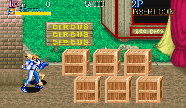

Szenen (über die Kamerastrecke verteilt, zuletzt Bossarena bzw. Stage-Ende):

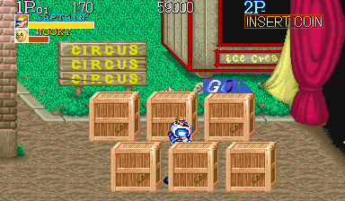 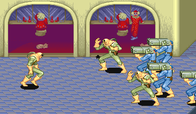 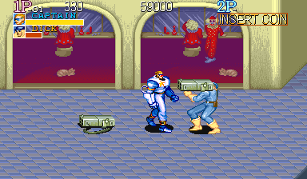 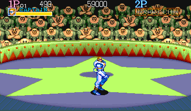 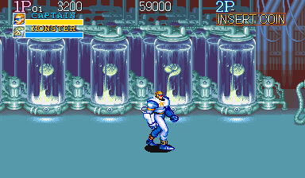 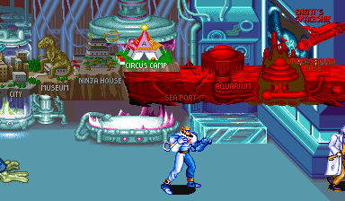

Panorama:

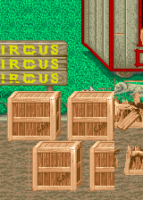

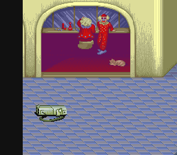

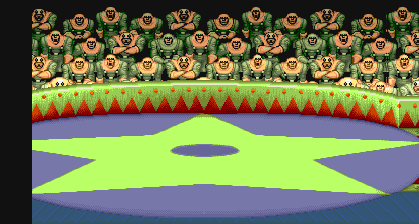

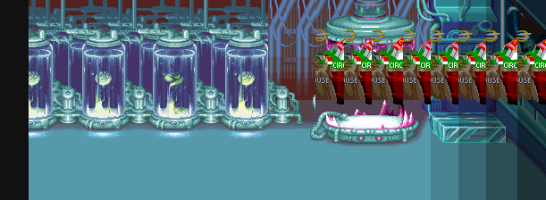

### Schauplatz

Vier getrennte Abschnitte, verbunden durch Skript-Ausgänge und eine Stern-Irisblende (Bild steht 3–5 Frames, Stern schließt in 7 Stufen zu 4 Frames = 28 Frames, 78 Frames schwarz in Farbe (17,17,17), öffnet in 28 Frames; Gegenprüfung). A) Vor dem Zirkus bei Tageslicht in sattem Grün, Braun und Karmin: links eine rotbraune Ziegelsäule, dahinter Rasen mit Hecke, ein Holzwegweiser „CIRCUS CIRCUS CIRCUS“ in gelben Buchstaben, ein rot-hölzerner Zirkuswagen mit „Ice Cream“-Schild und ein schlafender grauer Hund; brauner Erdweg mit Steinkante, sechs Holzkisten in zwei Reihen, rechts gelb-karminrote Zeltvorhänge. Eine Clown-Statue auf Sockel (gelber Punkteanzug, grüner Hut) am Zelteingang steht vor den Figuren. B) Im Zirkus: cremebeige Wände mit zwei großen Bögen, dahinter eine magenta-lila beleuchtete Bühne mit Clowns in Rot (einer auf einem Topf, ein Stelzenclown im rot gepunkteten Anzug); blaugraue Rautenfliesen. Rechts führt ein diagonaler Steg zu einem Sims mit goldener Kordel über einer schwarzen Grube, in die der Spieler automatisch springt.

C) Manege, sehr bunt: limettengrüner Stern auf lila Ringboden mit dunklem Oval in der Mitte, Ringwand mit rot-grünem Zickzack, darüber Ränge voller identischer sitzender WOOKY-Soldaten (statisches Publikum); roter Teppich links, rechts eine orange „DANGER“-Tür mit Clownsgesicht in limettengrünen Wänden. D) Kaltes Cyan-/Türkis-Labor vor dunkel lila Rückwand: Reihen hoher Glasröhren mit leuchtend gelbgrünen embryoartigen Kreaturen, Rohre und Maschinen, in der Mitte eine große rosa beleuchtete Brutkapsel mit runder Haube (der Boss); rechts eine Plattform aus cyanfarbenen Glasblöcken vor einer Konsolenwand mit Skalen und LED-Balken, darauf der Wissenschaftler. Abschluss: „STAGE 4 CLEAR / CAPTAIN DEFEATED THE MONSTER / CAPTAIN EARNED 5000 PTS“.

### Kennwerte

| Größe | Wert |
|---|---|
| Länge | Kamera-x 256–4164 in vier getrennten Abschnitten: A 256–385 (129 px frei); B 1280 (gesperrt, Skript-Scroll bis 1520); C 2304–2432 frei (128 px), Skript bis 2688; D 3584–3920 frei (336 px), Skript bis 4164. Kameraweg gesamt 1333 px; Kartenbreiten A 513, B 624, C 768, D 964 (ca. 2870 px) |
| Vertikales Scrollen | Keines (Kamera-y 0); Wackeln 0–4 px bei Raketen- und Mech-Explosionen, Muster 5/0/2 für 10–18 Frames bei jeder Bosslandung |
| Kamerasperren/Arenen | A: keine Sperre, Ausgang erst, wenn beide WOOKY weg sind. B: Kamera-x 1280, solange die 2 kämpfenden DICKs leben. C: Arenasperre 2432 (Mechs und Wellen starten erst dort). D: Bosssperre 3920 |
| Begehbarer Tiefenbereich | A 10–85 (Kisten fest); B 10–117; C vorn 10, hinten gekrümmt wie der Ring (101 bei x 2368, 114 bei 2490, 117 bei 2613); D 10–85, nahe der Plattform (x über ca. 4160) nur bis ca. 69 |
| Scroll-Ebenen und Parallaxe | Zwei Kachelebenen, beide 1:1, keine Parallaxe. Vor den Figuren: Clown-Statue (A); Kisten sind tiefensortiert. Publikum ist statischer Hintergrund |
| Objekte | 6 Kisten „W.BOX“ (ca. 58×56 px, fest, ein Treffer zerbricht); Inhalt je Lauf verschieden: Saxofon, Schatztruhe, graues Kanister-Objekt bzw. Haggar-Büste (+5000 Punkte) und SHURIKEN; restliche Kisten zerplatzen am Ausgang von A. Raketenwerfer toter DICKs werden Boden-Items. Fahrzeuge: 2 Mechs mit „RIDE ON“-Schild. Gefahren: DICK-Raketen (5 px/Frame, Explosion ca. 93 Frames), Gefrierstrahl des blauen Mechs. Grube in B nur Skript. Kein Essen gesehen |
| Dauer | Ohne Kämpfe ca. 2700 Frames (ca. 45 s): Gehen 846, Übergänge 320/307/385, Boss-Intro 170, Bosstod bis nächste Stage 703. Bot 5643 Frames (94,6 s) mit 2 Eingriffen |

### Gegner

| Gegner (HUD-Name) | Typ S+0x38 | Max-LP | Aussehen | Auftreten | Animationen (Frames × Dauer) |
|---|---|---|---|---|---|
| WOOKY | 0x0005A97E | 22 (A/B), 24 (Arena, Mech-Fahrer) | Gebückter Soldat mit kahlem hellbraunem Kopf und großer Hakennase, olivgrüne Tarnkleidung, brauner Gürtel; Boxerhaltung; ca. 45–58 breit, 66–74 hoch mit Schatten | 13: A 2 (einer versteckt hinter den Kisten, flieht); B 3 fliehend; C 2 als Mech-Fahrer und 6 von den Rändern | Gehen 8×4 (1,75 px/Frame), Flucht gleiches Set mit 3 px/Frame; Haltung 3×5; Spott 10/8/8/8/7/1; Ausfallschlag: Ausholen 21–25, dann 4/5/12/5 (7–8 LP, ca. alle 64 Frames, zerbricht auch Kisten); Tod ca. 77 |
| DICK | 0x00064E7A | 19 (Kämpfer), 16 (Fliehende/Cameo) | Schläger im blauen Overall mit blauer Mütze, hellbraune Haut, großer olivgrüner Kasten-Raketenwerfer auf der Schulter; ca. 54×70 | 6: B 4 (2 kämpfen, 2 fliehen und feuern je eine Rakete); C 2 als Cameo (feuern, gehen ab) | Gehen 8×4 (1,75 px/Frame); Werfer-Handhabung 10–30/8/8/8/7/1; Raketenschuss 5/1/10/1; Tod 77; kein Aufstehen und kein Nahkampftreffer beobachtet |
| MECH (Ride Armor) | 0x0009ADEA | 85 (Anzeige-Max 72) | Zweibeiniger Walker mit dicken Beinen, Kastenkörper, Armkanone und Sattel mit WOOKY; einer orange/kupfer, einer stahlblau; ca. 93–115 breit, ca. 106 hoch | 2 zu Beginn der Arenasperre (orange von links, blau von rechts) | Ansturm 6×4 (ca. 3,5 px/Frame); Gehen 6×7 (ca. 1,5 px/Frame); Gefrierstrahl (blau): Eisblock 100–113 Frames, 15 LP; Rammstoß (blau) 15 LP; Zerstörung mit Explosionen; Angriff des orangen Mechs nicht identifiziert |
| Wissenschaftler (kein Kämpfer) | 0x00058C64 | – | Alter Mann mit wildem weißem Haar, Brille, weißem Laborkittel, orangem Hemd mit Krawatte, brauner Hose und Stock; ca. 35–40 × 78 | 1, auf der Cyan-Plattform ab Beginn von D | Jubeln 8/8, wenn der Boss trifft; Wüten mit erhobenem Stock 8/8, wenn der Boss liegt; flieht nach dem Bosstod (2,75 px/Frame); keine Angriffe |

Pose-Galerien dieser Stage: [`stage4_03dab0.png`](gegner/stage4_03dab0.png) (MONSTER (Boss)), [`stage4_058c64.png`](gegner/stage4_058c64.png) (Wissenschaftler (kein Kämpfer)), [`stage4_05a97e.png`](gegner/stage4_05a97e.png) (WOOKY), [`stage4_064e7a.png`](gegner/stage4_064e7a.png) (DICK)

### Boss

MONSTER (Typ 0x0003DAB0), 140 LP. Gorillahafter Mutant mit grün gesprenkelten Muskeln, langen Armen, zerrissener blauer Jeans mit rotem Gürtel und blauer Kapuze/Maske mit roten Augen; Box 103–111 × 93–97, mit erhobenem Arm 114 px hoch. Er wartet in der rosa Kapsel, wächst, das Glas zerspringt, er atmet/brüllt zweimal in einer Schleife und springt heraus; der Kampf beginnt ca. 170 Frames nach dem Erwachen. Gehen 6×9 (ca. 0,95 px/Frame). Angriffe: Überkopf-Hammerschlag (22 Frames, Reichweite ca. 94–107 px, 21–22 LP mit Niederschlag), Sprung-Körperpresse (ca. 63 Frames, ca. 140 px nach vorn, 22 LP, Bildschirmwackeln bei der Landung) und rollende Kanonenkugel (ca. 70 Frames, ca. 210 px, 21 LP). Muster: herankommen, Schlag oder Sprung im Wechsel, Rückzug, Atemschleife; Treffer gegen einen passiven Spieler alle 160–430 Frames. Beim Tod fliegt er langsam ca. 120 Frames rückwärts; der Wissenschaftler flieht.

### Auffälligkeiten

- Kisteninhalte unterschieden sich zwischen zwei Läufen (zufällig oder zeitabhängig).
- Zu Beginn von B laufen 5 von 7 Gegnern geskriptet davon (2 feuern Raketen); in A flieht der zweite WOOKY.
- Während der Skript-Ausgänge scrollt die Kamera weiter (B 1280→1520, C 2432→2688, D 3920→4164); diese Bereiche sind nicht begehbar.
- Das Mech-Reiten wurde gesehen, aber nicht verifiziert (Versuch scheiterte).
- Eingriffe im Bot-Lauf: in der Arena 6 Gegner auf 1 LP (inkl. orangem Mech), Boss 111→1; volle 140 LP wurden nie natürlich abgekämpft.

## Stage 5: SEA PORT

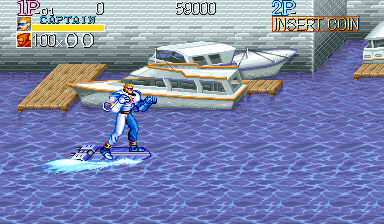

Szenen (über die Kamerastrecke verteilt, zuletzt Bossarena bzw. Stage-Ende):

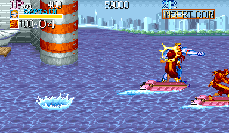 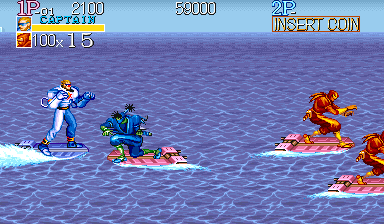 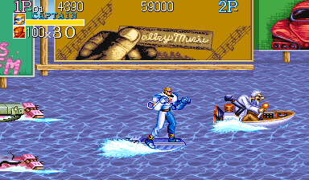 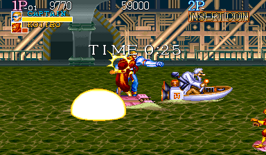 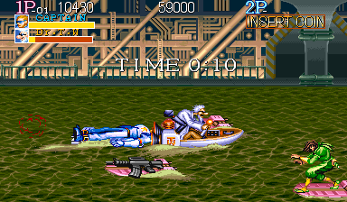 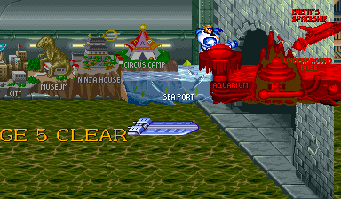

Panorama:

Die Hoverboard-Fahrt ist etwa 33.000 px lang und in fünf Bilder geteilt; hier nur das erste: `stages/stage5_panorama_1.png`, `stages/stage5_panorama_2.png`, `stages/stage5_panorama_3.png`, `stages/stage5_panorama_4.png`, `stages/stage5_panorama_5.png`.

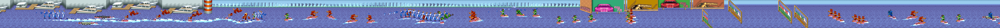

### Schauplatz

Fahrzeug-Stage: Der Held fährt auf einem blau-weißen Jet-Board übers Wasser, die Kamera scrollt die ganze Zeit selbst. Abschnitt 1, Hafen und Bucht bei hellem Tag: blau-violettes Wasser mit weißem Wellenmuster (wiederholt sich alle 48 px), hellblauer Himmel. Abfolge nach Kamera-x: Hafen (0–ca. 1900) mit grauer Ziegel-Kaimauer, Holzstegen und weißen Motoryachten mit orangem Rand; ein großer rot-weiß gestreifter Hafenturm (ca. 2000–2100); offene Bucht mit blaugrauer Hochhaus-Skyline über grüner Baumlinie (ca. 2100–4900); eine Reihe riesiger Werbetafeln auf Holzstelzen (ca. 4900–5900: hölzernes „CAPCOM“, grüne „KISS FM“-Tafeln mit Auto, braun-orange „Valley Music“ mit großer Hand); ein Feld schräg im Wasser stehender weißer „KIKI 98 FM“-Tafeln (ca. 5900–7000); offene See (ca. 7000–8800); Tafelreihe (ca. 8900–9900); zweites KIKI-98-Feld (ca. 9900–11300); offene See (ca. 11400–14200); Tafelreihe (ca. 14300–14945), dann eine Steinmauer mit Tunnelbogen. Dort taucht Dr. T.W. im Rennboot auf; liegt der Held vorn, erscheinen „WIN“ und „WINNER BONUS 1000“, dazu wird der Abschusszähler (100 je Abschuss) verrechnet. Der rechte Steinpfeiler des Bogens verdeckt Held und Boot bei der Einfahrt.

Abschnitt 2, unterirdischer Kanal, düster und kränklich grün: olivgrünes Schleimwasser mit braunen Wellen, beiger Schaum als Kielwasser. Der Hintergrund wechselt zwischen einer grün-grauen Tunnelwand (große waagrechte Röhre, Wandlampen, Leuchtstreifen, Maschendraht, Pfeiler) und einer offenen goldbronzenen Maschinenhalle (diagonale Träger, Rohrgestelle, dunkle Torbögen mit grünen Pfeilern). Während der Bossjagd läuft ein Countdown „TIME 0:40“. Am Ende kommt ein Steinbogen mit grauem Steinanleger; der Held springt vom Board und lässt es treiben. Stimmung: vom sonnigen Hafen in eine schmutzig-grüne Industriekanalisation.

### Kennwerte

| Größe | Wert |
|---|---|
| Länge | Abschnitt 1 Kamera-x 0–14945 (Welt 0–15329). Abschnitt 2 ab 15360; Ende hängt vom Bosskampf ab: Bot-Lauf bis 23944 (gesamt ca. 23500 px), Leerlauf bis 32134, ohne Boss kein Ende (über 39800) |
| Vertikales Scrollen | Keines (Kamera-y 0) |
| Kamerasperren/Arenen | Keine; Autoscroll beschleunigt auf 6 px/Frame (ab ca. Frame 25) und hält das Tempo, Stopp bei 14945 nach 42,0 s. Bosskampf als bewegte Arena unter Zeitlimit; danach noch ca. 2100–3100 px bis zum Ausgang |
| Begehbarer Tiefenbereich | Auf dem Board Tiefe 10–117 im Hafen (Kamera-x < 2063) und an den Plakatreihen, auf offenem Wasser 10–149 (Gegenprüfung); Bildschirm-x 24–288. Tiefe exakt 2/Frame (diagonal 1,5); rechts +1,75, links −4 px/Frame relativ zum Bild; Sprung 40 Frames, Scheitel 52 |
| Scroll-Ebenen und Parallaxe | Abschnitt 1: Hauptebene 1:1 (Wasser, Kai, Stege, Yachten, Turm, Tafeln, Bogen), ferne Ebene exakt 1/8 (Himmel, Skyline). Abschnitt 2: Hauptebene 1:1 (Kanal, grüne Tunnelwand), Maschinenhalle exakt 1/4 (wiederholt sich alle 3072 Kamera-px). Kein Zeilenscroll. Vor den Figuren nur der rechte Pfeiler des Tunnelbogens |
| Objekte | 10 „KIKI 98 FM“-Tafeln (Kachelgrafik, ca. 150×150 px, wirken als diagonale 60×60-Barriere): Aufprall 8 LP mit Niederschlag, 122 Frames bis zur Kontrolle, Tafel bricht zum Stumpf, +500 Punkte. Pickups auf treibenden pinken Brettern (ca. 140 Frames im Bild): Sturmgewehr, Raketenwerfer, Riesen-Shuriken, Essen (Reisschale mit Garnelen), kleine Waffe. Fahrzeuge: Board des Helden, pinke Gegner-Boards, Dr. T.W.s Rennboot. Keine Kisten oder Fässer |
| Dauer | Bot 4940 Frames (82,8 s), Boss besiegt bei Frame 3953; Endsequenz Abschnitt 1: 420 Frames (Bot) bzw. 243 (Leerlauf). Keine Gegner-Eingriffe |

### Gegner

| Gegner (HUD-Name) | Typ S+0x38 | Max-LP | Aussehen | Auftreten | Animationen (Frames × Dauer) |
|---|---|---|---|---|---|
| KOJIRO | 0x0006C660 | 8 | Rot-gelber Ninja mit roter Kapuze und langem Haarzopf, geduckt auf pinkem Jet-Board, Arme wie Krallen; mit Board 96–103 × 68–70 | Abschnitt 1: 29 (Leerlauf) bzw. 31 (Bot), ab Kamera-x 1049 am rechten Rand, oft zu zweit oder viert; Abschnitt 2: Paare im Wechsel mit SASUKE, solange der Boss lebt | Fahrschleife 4×6; Abwurf vom Board 49 (8/1/6/34); Wasserspritzer 43 (7×6 + 1); kein Angriff beobachtet, jeder Treffer tötet |
| SASUKE | 0x00074164 | 8 | Langhaariger (braun) Kämpfer in grüner Tarnkleidung, geduckt auf pinkem Board, langes gerades Schwert mit weißer Klinge; 93–102 × 68–69 | Abschnitt 1: 24, ab Kamera-x 2135, meist Paare an den Tiefenrändern; Abschnitt 2: Paare | Fahrschleife 4×6; Schwertstoß 2/2/8, trifft 55–76 px voraus (5 LP); Sprungangriff ca. 69 mit 45 Frames Flug (7–8 LP); Abwurf 49 |
| Blauer Ninja (Name nicht angezeigt) | 0x00070430 | 8 | Blau-türkiser Ninja mit stacheligem schwarzem Haarknoten und grünen Hautdetails, geduckt auf pinkem Board; wirft einen grauen vierflügeligen Shuriken; ca. 103 × 77 | Abschnitt 1: 5 (ab Kamera-x 7223); Abschnitt 2 nur spät in langem Kampf | Einfahrt 6/6, dann gehalten; Wurf 16/2/1/1/2/1 (23), einmal pro Durchfahrt; Shuriken −10 px/Frame, lebt 13 Frames; kein Shuriken-Schaden beobachtet |

Pose-Galerien dieser Stage: [`stage5_058c64.png`](gegner/stage5_058c64.png) (Wissenschaftler (kein Kämpfer)), [`stage5_06c660.png`](gegner/stage5_06c660.png) (KOJIRO), [`stage5_070430.png`](gegner/stage5_070430.png) (HANZO), [`stage5_074164.png`](gegner/stage5_074164.png) (SASUKE)

### Boss

Dr. T.W. (Typ 0x00058C64), 70 LP. Verrückter Wissenschaftler mit wildem weißem Haar, buschigem Schnurrbart, Schutzbrille und weißem Laborkittel, im Heck eines creme-braunen Rennboots mit orangem Motorgitter, einer Kiste mit Kanji und Armaturenbrett; Sprite 103–128 px breit. In Abschnitt 1 liefert er sich ab Kamera-x ca. 14300 ein Rennen zum Tunnel. In Abschnitt 2 kämpft er auf der bewegten Arena unter „TIME 0:40“ (Bildschirm-x ca. 230–310, Tiefe ca. 40–55). Er wirft alle ca. 227–300 Frames: Einzelbombe (grün mit Flossen, Bogen 43 Frames bis Höhe 92, landet ca. 213 px voraus, Feuerball mit Feuerring; 10 LP und Brennen) oder Bombenkette aus 4 bzw. 6 schwarzen Bomben (Bogen 56 Frames, 120–216 px voraus; 8 LP mit Niederschlag). Steht der Held nah vor ihm, rammt er mit dem Boot (ca. 70 px, 8 LP mit Niederschlag), auch mehrfach gegen einen liegenden Helden. Besiegt hält er 180 Frames unter 29 Explosionen, steht verkohlt mit Röntgenblitz auf und treibt als Wrack davon („CAPTAIN EARNED 6000 PTS“, Zeitbonus 100 je Restsekunde). Bei „TIME OVER“ entkommt er, die Stage endet trotzdem mit „STAGE 5 CLEAR“.

### Auffälligkeiten

- Die KIKI-98-Tafeln sind Kachelgrafik mit unsichtbarem Kollisionsobjekt.
- Abschnitt 1 zeigt statt Gegnernamen einen Abschusszähler; der Name des blauen Ninjas ist daher nicht erfasst.
- Abschnitt 2 hat kein festes Ende; der Kanal scrollt, solange Dr. T.W. lebt bzw. der Timer läuft.
- WIN-Bonus vom Rennergebnis abgeleitet, nur aus zwei Läufen.
- Spawns sind an die Kamera gebunden, aber nicht völlig fest (Bot-Lauf 2 KOJIRO mehr).
- Doppeltippen (Dash) bringt auf dem Board kein zusätzliches Tempo.
- Dr. T.W. trägt dieselbe Typ-ID wie der Wissenschaftler in Stage 4.

## Stage 6: AQUARIUM

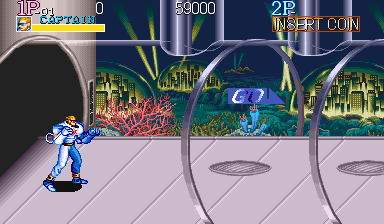

Szenen (über die Kamerastrecke verteilt, zuletzt Bossarena bzw. Stage-Ende):

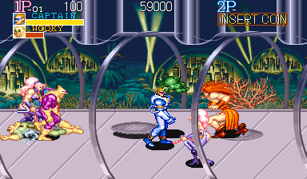 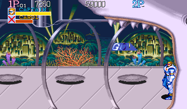 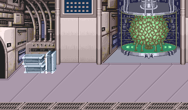   

Panorama:

### Schauplatz

Unterwasser-Forschungskomplex mit drei Bereichen. (A) Aquarium-Tunnel (Kamera-x 256–897): Start vor einer dunklen runden Tunnelöffnung links. Ein langer Gehweg mit hell lila-grauen Fliesen und ovalen Gullygittern alle 128 px führt an einer hohen gebogenen Glaswand entlang; dahinter tiefblaues Wasser mit gelbgrünen Suchscheinwerfern, leuchtende Unterwasserstädte unter Glaskuppeln, Seetang, orange Fächerkorallen und blaue Anemonen. Dicke Silberrohre an der Decke; große silberne Röhrenringe kreuzen den Weg alle 128 px, ihre vorderen Beine laufen vor den Figuren. Am Ende bildet ein riesiger lavendelweißer Haikopf mit offenem Zahnmaul den Ausgang. (B) Labor (Kamera-x 1792 bis ca. 2560): grau-beige Industrie mit Konsolen, Kabeln, Rohren und blauen Lüftungsgittern; dunkle Schotttüren in der Rückwand, aus denen Gegner treten; links ein Stahlkistenstapel. Käfigtanks halten riesige organische Kugeln (grün auf türkisem Sockel, später orange-braun auf rotem Sockel). Im Klonraum liegt ein Orca unter gelbem Lichtstrahl mit Roboterarmen, ein Fenster zeigt roten Vulkan-Meeresboden. Ein Metallgitter am unteren Rand liegt hinter dem Helden.

(C) Beobachtungsdeck/Bossarena (Kamera-x ca. 2560–2936): abgerundete, sehr helle rosa-graue Plattform vor einer gebogenen Glaswand mit Unterwasser-Vulkanlandschaft (links dunkelrote Vulkane mit Lavaflüssen, rechts türkisblaue Klippen). Das Deck endet an einer ockerbraunen Felswand mit riesiger runder Stahl-Tresortür mit Spiralverschluss, aus der die Zwillingsbosse laufen. Stimmung: kühles Blau und Lila im Aquarium, metallisch-trüb im Labor, dunkel mit rotem Lavaschein auf dem Deck. Abschluss: „STAGE 6 CLEAR“, „CAPTAIN DEFEATED THE SHTROM&DRUK“, „CAPTAIN EARNED 5000 PTS.“; der Held geht durch die Tresortür ab.

### Kennwerte

| Größe | Wert |
|---|---|
| Länge | A Kamera-x 256–897 (641 px), harter Schnitt auf 1792, B+C 1792–2936 (1144 px); gesamt 1785 px |
| Vertikales Scrollen | Keines (Kamera-y 0); Wackeln 4, 3, 2, 1 px bei Explosionen und beim Aufschlag der Zwillinge |
| Kamerasperren/Arenen | (1) Kamera-x 856, Ende A (große Welle); danach GO, Kamera bis 897, Skript-Ausgang durchs Haimaul mit Stern-Iris, Kontrolle in B bei x 1858. (2) 2384 in B. (3) 2936 Bossarena; dort driftet die Kamera mit dem Helden (2878–2936). Keine Sperre am Beginn von B |
| Begehbarer Tiefenbereich | A 10–93; B 10–101; C gewölbtes Deck: bis 125 (x 2880–3018), 117 (x 3038–3088), dann diagonale Rückwand 111 bei x 3098 bis 69 bei x 3199; rechte Wand bei x ca. 3199–3205. Füße y 109–224 |
| Scroll-Ebenen und Parallaxe | Hauptebene 1,0 (Boden, Wände, Rohre, Glasrahmen, Ringe, Labor, Deck, Tresortür). Ferner Hintergrund exakt 0,5 (Unterwasserstadt in A, Vulkan im Orca-Fenster in B, Vulkanpanorama in C). Vor den Figuren nur die Röhrenringe in A (1,0); in B und C nichts |
| Objekte | 6 Gullydeckel in A (x 496–1136, 8 Gegner steigen aus); 3 Hintertüren in B; 1 Stahlkistenstapel (x 1872) mit Tempura-Schale. Bazookas der DICKs als Pickups (auch WOOKY kann sie aufheben und feuern); Raketen lassen sich wegschlagen („MISSILE“). Fahrzeug: blauer Mech (85 LP, Anzeige-Max 72; ca. 100×100 px) mit WOOKY-Fahrer, „RIDE ON“. Gefahren: DICK-Raketen, MARDIA-Schleimpfütze (ca. 40 Frames), Boss-Kugeln, MARBIN-Flammenwand; keine Gruben oder Fallen |
| Dauer | Reines Scrollen ca. 1020 Frames (17 s) plus ca. 375 Frames Skript. Bot 8826 Frames (148 s) mit 3 Eingriffen; natürlicher Bosskampf ca. 5400 Frames (90 s) |

### Gegner

| Gegner (HUD-Name) | Typ S+0x38 | Max-LP | Aussehen | Auftreten | Animationen (Frames × Dauer) |
|---|---|---|---|---|---|
| WOOKY | 0x0005A97E | 22, 24 (A); 26, 28 (B) | Gebückter Glatzkopf mit gelblich-hellbrauner Haut, olivgrüner Tarnkleidung, braunem Gürtel und Kreuzgurt, hellbraunen Stiefeln; ca. 58–65 × 73–79 | 7: A 3 aus Gullys und 1 als Mech-Fahrer von links; B 3 aus Hintertüren | Gehen 8×4 (ca. 1,6 px/Frame); Haltung 3×5; Gully-Ausstieg 47 (9/9/9/9/5/5/1); Schlag ca. 22 (8 LP); mit Bazooka 27 (feuert Rakete); Aufstehen 18; Tod 78, zuletzt blinkend 3 an/3 aus |
| EDDY | 0x00060CA0 | 32, 34 (A); 36, 38 (B) | Gebückter Mutant mit kahlem gelblich-hellbraunem Kopf, magenta-lila Body, gelben Handschuhen und Stiefeln, Boxerhocke; ca. 59 × 72 | 5: A 2 aus Gullys; B 3 aus Hintertüren | Gehen 8×4 (ca. 1,8 px/Frame); Gully 47; beidhändiger Ausfallschlag nach ca. 25 Frames Hocke, 27 Frames (8 LP); Taumeln 4×6; Tod 78 |
| DICK | 0x00064E7A | 20, 21 (A); 24 (B) | Soldat in blauem Overall und blauer Mütze, hellbraune Haut, große olivgrüne Bazooka auf Hüfthöhe; ca. 51–64 (mit Bazooka bis 82) × 67–78 | 5: A 3 aus Gullys; B 2 aus Hintertüren | Gehen 8×4 (ca. 1,8 px/Frame); Nachladen 10/8/8/4–8; Bazooka-Schuss 17, Rakete ca. 4,5 px/Frame über ca. 90 px, Explosion ca. 90 Frames (13 LP und Brennen); Tod 78; Bazooka wird Pickup |
| CAROL | 0x00036FB2 | 30 (erste Welle), 35 (Sperrwelle) | Lange pinke Haare, lila-fliederfarbener Panzer-Body, Overknee-Stiefel, kurzer roter Schockstab; ca. 46 × 76 | 4, alle in A, fallen von der Decke (x 448, 704, 960 zweimal) | Herabfallen 34–35 aus Höhe 240; Gehen 8×6 (ca. 2,3 px/Frame, schnellster Normalgegner); Sprungtritt 6 + 34 (Höhe ca. 75, ca. 117 px); Elektroschock ca. 30 (13 LP); Tod 81; Verbrennungstod 112 |
| MARDIA | 0x0003A2D6 | 85 (Anzeige-Max 72) | Große muskulöse Barbarin mit riesiger orange-roter Löwenmähne, oranger Tunika, roten Stiefeln und Armschienen; ca. 70 (mit Armen 95–107) × 90–94, größter Normalgegner | 1, von rechts in der ersten Welle | Gehen 8×8 (ca. 1,2 px/Frame); Schleimspucke 15/4/6/3/20, grüner Ball im Bogen ca. 90 px, Pfütze ca. 40 Frames; Aufstehen 25; Tod 127 |
| Z | 0x0003265C | 70 (B); 90 (Anzeige-Max 72) als Boss-Verstärkung | Silbergraues biomechanisches Alien (xenomorph-artig): langer glatter Schädel, gerippter Torso, dünne Digitigrad-Beine, Schwanz, ein teleskopierbarer Segmentarm mit dreiklingiger Klaue; ca. 45–60 × 94–112, Klaue reicht ca. 160 px | B: 2 von rechts; Bosskampf: 1 | Gehen 8×6 (12 px je Schritt, ca. 1,8–2 px/Frame); kurzer Klauenstoß 30 (10 LP); langer Klauenvorstoß 100–113, Arm schießt in 7×2 heraus (19 LP); Aufstehen 61; Tod 96 |
| MARBIN | 0x00029C36 | 48 (B); 16 (Flammenwerfer-Trupp) | Kleiner stämmiger Glatzkopf mit brauner Lederhaube/-umhang über den Schultern, weiße Hose; ca. 47–60 × 57–63, kleinster Gegner | B: 1 von rechts; Bossarena: Vierertrupps vom linken Rand in einer Säule (Tiefen 88/68/48/28) | Gehen 6×4 (ca. 1,2 px/Frame); Trupp: Einlauf, Zielen 8/8/10, Feuer 110, Abgang; Flammenstrahl ca. 120 px, 109 Frames, zusammen eine Feuerwand über alle Tiefen der linken Arenahälfte (16 LP und Brennen) |

Pose-Galerien dieser Stage: [`stage6_029c36.png`](gegner/stage6_029c36.png) (MARBIN), [`stage6_03265c.png`](gegner/stage6_03265c.png) (Z), [`stage6_036fb2.png`](gegner/stage6_036fb2.png) (CAROL / BRENDA), [`stage6_03a2d6.png`](gegner/stage6_03a2d6.png) (MARDIA), [`stage6_05a97e.png`](gegner/stage6_05a97e.png) (WOOKY), [`stage6_060ca0.png`](gegner/stage6_060ca0.png) (EDDY), [`stage6_064e7a.png`](gegner/stage6_064e7a.png) (DICK), [`stage6_08065a.png`](gegner/stage6_08065a.png) (SHTROM & DRUK (Boss))

### Boss

SHTROM & DRUK, zwei mutierte Schützen (beide Typ 0x0008065A), je 125 LP (Anzeige-Max 72, zwei Balkenschichten pro Zwilling). DRUK hat eine wilde pink-rote Mähne, lila Haut und Anzug, kastanienbraune Stiefel; SHTROM eine wilde blond-gelbe Mähne, rosa Haut, grüne Handschuhe, Stiefel und Geschirr. Beide sind gebückt, ca. 73–86 × 91–97, mit langen grünen Gewehren. Die Tresortür schwingt auf, beide laufen nebeneinander heraus (ca. 3 px/Frame, 207 px), die Tür schließt sich. Angriffe: Arenasprung bis 232 px zur Neupositionierung; Gewehrfeuer als Einzelschuss oder Fächer aus 7 Kugeln, die das ganze Tiefenband abdecken (8 px/Frame, Abpraller an der Wand, 15–17 LP); brennender Torpedo, bei dem sich ein Zwilling mit brennenden Haaren zur Kugel rollt, waagrecht bis 163 px heranschießt (ca. 7 px/Frame) und von Wand oder Tür abprallt (24–25 LP); Griff durch DRUK ohne LP-Verlust. Verstärkung: zwei MARBIN-Flammenwerfertrupps und ein Z. Wer einen Zwilling besiegt, besiegt beide: SHTROM starb mit 31 Rest-LP im selben Frame wie DRUK; übrige Helfer springen davon.

### Auffälligkeiten

- Der angezeigte Max-LP-Wert übersteigt nie 72; der Überschuss (MARDIA, Mech, Z, Zwillinge) erscheint als cyan/grüne Zusatzbalken.
- Gegner-LP und Schaden steigen über die Stage (WOOKY 22→28, EDDY 32→38; Boss-Kugeln 15→17 LP).
- Die MARBIN-Trupps erscheinen ohne erkennbare LP-Schwelle.
- Das Alien heißt im HUD nur „Z“.
- Eingriffe im Bot-Lauf: 3-mal Gegner-LP auf 1 (Sperre 856, Kamera-x 1882, Zwillinge). Alle Bossdaten stammen aus einem eingriffsfreien Lauf.

## Stage 7: UNDERGROUND BASE

Szenen (über die Kamerastrecke verteilt, zuletzt Bossarena bzw. Stage-Ende):

     

Panorama:

### Schauplatz

Sechs Bereiche. (A) Roter Maschinenkorridor (Kamera-x 256 bis ca. 1234): Start vor einer großen runden Stahlluke am linken Rand. Dahinter und darunter eine dichte, fast organische Wand aus karmin- und magentafarbener Maschinerie (Röhrenbündel, Kabel, fassartige Teile), deren Farbe mit 64-Frame-Periode zwischen dunklem Karmin und Pink pulsiert, sodass die Wand „atmet“. Der Gehweg ist ein pinkes Deck mit Platinenstreifen und dünnem blauem Draht, graue Metallschienen laufen längs, blaue Bodenpfeile zeigen nach rechts (nur Deko). Dicke pinke Säulen tragen mechanische „Spinnen“-Ornamente; gegen Ende beginnt ein silbernes Schott. (B) Abwärtsrampe (x ca. 1240–1990): Der Weg fällt nach rechts ab; oben eine silbergraue Maschinenwand mit großen runden Turbinenluken und hängenden Kabeln, unten die rote Maschinengrube mit grauen Stützrohren. (C) Aufzugsplattform (Kamera-x 1921): flaches Deck vor einer dunklen Tür mit grauen Schiebetürpfeilern und beleuchtetem blauem Gitterpaneel; rechts öffnet sich eine runde Luke, Captain geht automatisch hinein, Stern-Iris.

(D) Präparate-Labor (Kamera-x 2816–3617): Captain tritt durch eine runde Luke links, deren silberner Ring vor ihm liegt. Hellgrauer Fliesenboden mit diagonalen Fugen, olivfarbene Fußleiste; die Rückwand ist eine Reihe Labormaschinen mit großen roten gehörnten Dämonenstatuen und tentakelartigen Kabeln, die wie ein Fließband ständig nach links gleitet. (E) Boss-Büro (Zwischensequenz): türkis gemusterter Teppich, blassblaue Wände, großes Gemälde roter Dämonen, Holzschreibtisch mit Blumenvase und Raumschiffbild; BLOOD sitzt im Schneidersitz darauf und verschwindet, der Schreibtisch explodiert, Captain fällt durch das Loch. (F) Schacht und Raumschiffdeck: ein langer grauer Metallschacht mit Gitterringen, dann das Heck eines grauen Raumschiffs (Flügel und Triebwerk links, helles Fliesendeck, graue Paneele mit Bolzenringen). Dahinter ziehen braun-kupferne Gitterbögen und Steinsäulen eines Hangars unter lila Nachthimmel immer schneller vorbei, das Bild hebt und senkt sich. Stimmung: heiße rote Maschinen, kalte Silbertechnik, steriles Labor und Büro, nächtlicher Start. Abschluss: „STAGE 7 CLEAR / CAPTAIN DEFEATED THE BLOOD / CAPTAIN EARNED 7000 PTS“.

### Kennwerte

| Größe | Wert |
|---|---|
| Länge | Kamera-x 256–4701 mit Sprüngen: 256→1921 (1665 px); Sprung auf 2816, 2816→3617 spielergesteuert, 3617→3968 Autoscroll im Büro; Sprung auf 3712 (Schacht); Sprung auf 4352, 4352→4608 Landung, 4608 Boss, 4608→4701 Ausgang. Horizontal gesamt ca. 3073 px |
| Vertikales Scrollen | Ja: Korridor Kamera-y 1536; Rampe fällt 0,5 px je px nach rechts (1520 bei Kamera-x 1265, 1439 bei 1425, 1280 bei ca. 1747); 1280 auf Plattform, Labor, Büro; Schacht 1024 → −8 mit 8 px/Frame; Bossdeck schwankt selbstständig 0–27 (Zyklus ca. 1150 Frames) |
| Kamerasperren/Arenen | Kamera-x 1264/1265 (EDDY-Welle), 1601 (EDDY/DICK-Welle auf der Rampe, nur solange sie lebt), 1920/1921 (MARDIA-Welle, danach Autowalk zum Aufzug), 3616/3617 (Laborausgang, DICK- und WOOKY-Welle), 4608 (BLOOD). Keine Sperre im Korridor; 3968 ist nur das Skriptende |
| Begehbarer Tiefenbereich | Korridor 1590–1685 (95 px, an der Startluke diagonal begrenzt); Rampe ca. 95 px breit, gleitet 0,5 je x-px abwärts; Plattform, Labor und Büro 1290–1365 (75 px); Bossdeck 70–149 (79 px) |
| Scroll-Ebenen und Parallaxe | Korridor/Rampe: nahe Ebene 1,0, ferne Ebene 0,5 in x und y (rote Maschinerie, Textur alle 64 px, Palettenpuls 8 Stufen × 8 Frames). Labor: Präparate-Reihe = Kamera plus Autoscroll 0,5 px/Frame nach links. Schacht: Röhre 1,0 vertikal. Bossdeck: Deck 1,0, Hangar = Kamera plus Autoscroll bis 5 px/Frame. Büro statisch. Vor den Figuren nur der Lukenring am Laboreingang |
| Objekte | Nur DRUMCAN-Fässer (15 in 5 Abwürfen, rollen, 16 LP Kontaktschaden, zerbrechen bei Treffer); Inhalt M-GUN, 4× MISSILE, SHURIKEN, eine unbekannte kleine Waffe. DICKs lassen ihre Waffe fallen (Pistole, M-GUN, MISSILE), einer Kirschen (einziges Essen). Gefahren: DICK-Rakete (Bodenexplosion ca. 95 Frames), MARDIA-Glibber (ca. 37 Frames). Bürofalltür ist Skript. Keine Fahrzeuge |
| Dauer | Ohne Kämpfe ca. 3330 Frames (ca. 56 s). Bot 16012 Frames (268 s) mit 7 Eingriffen |

### Gegner

| Gegner (HUD-Name) | Typ S+0x38 | Max-LP | Aussehen | Auftreten | Animationen (Frames × Dauer) |
|---|---|---|---|---|---|
| KOJIRO | 0x0006C660 | 26 (Welle 1), 28 (Welle 2) | Ninja in rotbrauner Kapuzenrobe mit goldgelben Handschuhen, Stiefeln und Besatz, tief geduckt; ca. 45–60 × 70 (geschätzt) | 7: 4 fallen in Welle 1 von oben (Höhe 240), 3 laufen von rechts herein | Fallen 29 + Landung 4/4/4/1; Gehen 6×4; Haltung 4×6; Kurzschwert-Ausfall mit Stich 30 (ca. 8 LP), dann Rückwärtssalto 41 (ca. 120 px); Benommen 4×6 |
| SASUKE | 0x00074164 | 32 | Wie KOJIRO, aber grün mit Goldbesatz | 2, fallen in Welle 1 von oben | Fallen 29; Gehen 6×4; Haltung 4×6; Ausfallstich 4/4/8 + 3/26; Rückwärtssalto 41; die Landung traf einmal (16 LP) |
| WOOKY | 0x0005A97E | 24, später 26, 28, 34 | Gebückt, kahl, blassgelbe Haut, olivfarbene Tarnkleidung mit Gürteltasche, hellbraune Stiefel, Tank mit Schlauch über der Schulter; Box 49–61 × 75–81 | 9: 5 am Korridorende, 1 auf der Rampe, 1 auf der Plattform, 2 an der Bürotür | Einlauf 7×4; Gehen 8×4 (ca. 1,7 px/Frame); Sprung 16–31; Boxkombo ca. 58 (8–10 LP, einmal 16); Verbrennen 43 |
| EDDY | 0x00060CA0 | 34, 36, 38 | Muskulös, kahl, gelblich-hellbraune Haut, magenta-pinker ärmelloser Anzug, lila Brille/Stirnband; ca. 55 × 75 | 10: 5 an der Rampensperre, weitere auf Rampe und Plattform | Einlauf 7×4 bzw. 4×6; Gehen 8×4; Schlag 8 + 1, 20 + 1; Hechtsprung 44 gehalten (Höhe bis 52, ca. 120 px); 9–10 LP |
| DICK | 0x00064E7A | 22, 23, 25, 28; 16 (Bazooka-Läufer) | Gelbhäutiger Schläger mit blauer Mütze und blauer Jeansweste, Waffe auf Hüfthöhe (Pistole, M-GUN oder MISSILE); Box 62–74 × 69–76 | 14: 7 auf der Rampe, 2 auf der Plattform, 5 an der Bürotür (davon 4 Bazooka-Läufer von beiden Seiten) | Gehen 8×4; Sprung 31–40 (Höhe 64); Schlag; Bazooka-Läufer: einlaufen, zielen 20, Schuss 5/1/10/1, wieder ab nach ca. 80–90 Frames; 9–14 LP |
| MARDIA | 0x0003A2D6 | 95 bzw. 100 (Anzeige-Max 72) | Große Frau mit riesiger wilder oranger Mähne, hellbrauner Haut, orangem Trikot/Lendenschurz, gebückt; ca. 70 × 90 (geschätzt) | 4: 2 vom linken Rand an der Plattform, 2 im Labor | Gehen 8×8 (ca. 1 px/Frame); großer Sprung 41 (Höhe 64, ca. 115 px); Griff mit Überkopf-Wurf/Slam; grüner Energieball im Bogen; 9–13 LP; Aufstehen 25 |
| MUSASHI | 0x0002D15C | 55 | Stämmiger Samurai in brauner Lamellenrüstung mit Schulterplatten, olivfarbene Hakama, braune Stiefel, Katana über dem Kopf; ca. 70 × 95 bis zur Schwertspitze (geschätzt) | 2, im Labor von rechts | Gehen 8×6 (ca. 1 px/Frame); Wache 50–100; langer waagrechter Stoß nach Ausholen 3/3/8, Endpose 9–38 gehalten; zweiter Angriff 6–8 + 28; 9–13 LP |
| DRUMCAN (zerbrechliches Hindernis) | 0x000A0B3A | 2 (Anzeige-Max 0) | Braunes Holzfass mit grauen Bolzen; ca. 40 × 45 | 15 in 5 Abwürfen von oben (2, 4, 3, 2, 4) | Fall 288 px in 45 Frames; Aufprall-Sprung bis Höhe 69, rollt nach links (ca. 2,5 px/Frame, Rollzyklus 8×3); Kontaktschaden 16 LP; kann eine Waffe enthalten |

Pose-Galerien dieser Stage: [`stage7_02d15c.png`](gegner/stage7_02d15c.png) (MUSASHI), [`stage7_03a2d6.png`](gegner/stage7_03a2d6.png) (MARDIA), [`stage7_054056.png`](gegner/stage7_054056.png) (BLOOD (Boss)), [`stage7_05a97e.png`](gegner/stage7_05a97e.png) (WOOKY), [`stage7_060ca0.png`](gegner/stage7_060ca0.png) (EDDY), [`stage7_064e7a.png`](gegner/stage7_064e7a.png) (DICK), [`stage7_06c3e0.png`](gegner/stage7_06c3e0.png) (unbekannt), [`stage7_06c660.png`](gegner/stage7_06c660.png) (KOJIRO), [`stage7_074164.png`](gegner/stage7_074164.png) (SASUKE), [`stage7_0a0b3a.png`](gegner/stage7_0a0b3a.png) (DRUMCAN (zerbrechliches Hindernis))

### Boss

BLOOD (Typ 0x00054056), 190 LP (Anzeige-Max 72, gelbe und cyanfarbene Balkenschichten). Riesiger muskulöser Mann mit langer grün-blonder Dreadlock-Mähne, nacktem Oberkörper, Perlenkette, olivgrüner Cargohose und braunen Stiefeln; ca. 75 × 85, der fliegende Tritt ca. 145 × 45 (geschätzt). Er sitzt zuerst auf dem Büroschreibtisch; auf dem Raumschiffdeck zeigt er eine 61-Frame-Intro-Pose von verschränkten zu ausgebreiteten Armen („Komm her“). Gehen 6×7 (ca. 2,3 px/Frame). Hauptangriff ist der hohe Tritt (29 Frames, 29 LP mit Niederschlag). Dazu kommen ein fliegender Seitwärtstritt (60–61 Frames, in Höhe ca. 53 über 264–279 px, also fast den ganzen Bildschirm; Kurzversion ±65 px; 22 LP) und ein Saltosprung (96 Frames, Scheitel 99 px, ca. 130 px), mit dem er sich über den Spieler setzt. Muster gegen einen passiven Spieler: Tritt, 60–120 Frames warten, erneuter Tritt beim Aufstehen. Ein reiner Schlag-Bot verursachte keinen Schaden; mit Sprungangriffen fielen seine LP in ca. 3000 Frames von 190 auf 60.

### Auffälligkeiten

- Die meisten Wellen sperren die Kamera nicht; die Sperre 1601 besteht nur, solange die Rampenwelle lebt.
- Max-LP wechseln je Welle (KOJIRO 26/28, WOOKY 24–34, EDDY 34–38, DICK 16–28).
- Auf dem Bossdeck schwankt die Kamera von selbst (0–27), der Hangar scrollt automatisch.
- Der HUD-Name passt nicht immer (ein KOJIRO-Treffer zeigte „SASUKE“); Waffennamen überschreiben die Gegnerzeile.
- Größen von KOJIRO, SASUKE, EDDY, MARDIA, MUSASHI und BLOOD sind nur geschätzt; die Waffe aus dem Fass bei x 3233 ist unbekannt.
- Eingriffe im Bot-Lauf: 7-mal Gegner-LP auf 1 (u. a. BLOOD 190→1).

## Stage 8: ENEMY'S SPACESHIP

Szenen (über die Kamerastrecke verteilt, zuletzt Bossarena bzw. Stage-Ende):

     

Panorama:

### Schauplatz

Drei Bereiche. A) Raumschiff-Korridor (Kamera-x 256 bis ca. 1250, Welt-x 256–1540): warme goldene, Giger-artige biomechanische Wände mit organischen Goldskulpturen, Rohren und rippen- oder schädelartigen Formen, gerahmt von polierten Goldsäulen. Dunkle Türnischen liegen hinter dem Startpunkt (Welt ca. 360–470) und bei ca. 1300–1420 (dort erscheint das GO-Schild). Von ca. 560 bis 1130 läuft hinter einem Goldgeländer ein langes Fenster mit schwarzem Weltraum, einer riesigen goldenen Spiralgalaxie, blau-weißen Sternen und treibenden braunen Asteroiden; eine verzierte Goldstrebe kreuzt es bei ca. 770–830. Boden: türkises Riffelgitter hinten, dunkelblaue Paneele mit rot-blauen Leiterbahnen vorn; zwischen ca. 590 und 1000 Glasbodenplatten, durch die Weltraum und Asteroiden zu sehen sind. Stimmung: kalter türkiser Boden gegen warme Goldwände und schwarzen Weltraum. Ein gold-türkiser Schottrahmen (ca. 1490–1540) führt weiter.

B) Industriehalle (Kamera-x ca. 1250–1920, Welt 1540–2304): sepia-kupfernes Gerüst mit Rohren, Laufstegtreppen, Plattformen und beleuchteten cremefarbenen Fenstern, hinten ein Bronzegeländer; ein Stapel silberner genieteter Metallkisten (Welt-x 1632). Die Halle endet an einem riesigen türkisen genieteten Schutztor, das nach dem letzten Gegner mit gezacktem Loch aufgerissen wird; der Held geht automatisch hinein, eine Stern-Iris schließt in 25 Frames (7 Stufen zu 4 Frames), bleibt ca. 80 Frames schwarz und öffnet in 25 Frames (Gegenprüfung). C) Liftschacht (Kamera-x 2816–3200, Welt 2816–3585), ganz in warmem Sepia: genietete Holzplankenplattform mit dunklem Balken am unteren Rand, Holzgeländer hinten, links ein Treppengeländer und eine Wandplatte mit Fächeremblem. Hinter dem Geländer gleitet das Kupfergerüst des Schachts ca. 16 s nach oben, die Plattform sinkt wie ein Aufzug und stoppt mit kleinem Ruck. Das rechte Ende ist die Bossarena. Nichts läuft vor den Figuren vorbei; darüber liegen nur HUD, GO-Schild, 1P-Pfeil, Treffereffekte, Feuerbälle, Rauch, Flammen und brennende Figuren. Abschluss: „CAPTAIN DEFEATED THE DOPPEL“, 8000 Punkte.

### Kennwerte

| Größe | Wert |
|---|---|
| Länge | A/B Kamera-x 256–1920 (kurz 1921); Sprung 1920→2816 (Sternblende); C 2816–3200/3201. Gesamt 2049 px (1664 + 385); sichtbar Welt-x 256–2304 und 2816–3585 |
| Vertikales Scrollen | Keines (Kamera-y 0); Wackeln bei Raketenexplosionen (4…0 abklingend, ca. 32 Frames), Liftstart (3, 2, 1) und Liftstopp (1, 3, 2, 1) |
| Kamerasperren/Arenen | (1) 352, erreicht 135 Frames nach Start, bis Welle 1 tot ist. (2) 1120–1121: zeitgesteuerter Halt (268 bzw. 288 Frames) für zwei CAROL-Formationen, löst auch mit lebenden Gegnern. (3) 1776–1778: Z/DICK. (4) 1920: Ende B, bis der letzte Z, WOOKY, EDDY und DICK tot sind; dann öffnet das Tor. (5) 3117–3121 in C: MARBIN-/CAROL-/WOOKY-Wellen. (6) 3200/3201 Bossarena, Kamera folgt zwischen 3072 und 3200. Bot-Halte bei 477, 676, 1294 sind nur Kämpfe |
| Begehbarer Tiefenbereich | A/B 10–101 (91 px), Tiefengeschwindigkeit ca. 1 px/Frame; der Kistenstapel blockiert Tiefe ca. 85–100 bei x ca. 1600–1680. C (Lift und Arena) 38–117 (79 px) |
| Scroll-Ebenen und Parallaxe | Hauptebene 1,0 (Boden, Wände, Säulen, Streben, Geländer, Schott, Tor, Lift, Treppe). Ferne Ebene in A/B 0,5 (Galaxie, Sterne, Asteroiden in Fenster und Glasboden; in B das obere Kupfergerüst); während der Liftfahrt vertikal 0,5 px/Frame (Inhalt wandert nach oben), horizontal nur 0,25; danach wieder 0,5. Kein Vordergrund |
| Objekte | Metallkistenstapel „BLOCK“ (HP-Wert 777, ein Jab zerbricht ihn; ca. 67 × 45 px; fest): Braten auf weißem Teller. Formation-Statisten droppen Essen, wenn man sie tötet (Kirschen, Tempura-Schale, ein weiteres Item). DICK-Bazooka (Doppelrohr) liegt 218–389 Frames als Pickup. Gefahren: DICK-Rakete (Explosion ca. 95 Frames, verbrennt auch Gegner, Wackeln), MARBIN-Feuerströme (109 Frames, 92–128 px), Z-Klauen. Fahrzeug: absinkende Liftplattform |
| Dauer | Reines Gehen A/B 951 Frames (15,9 s), C 219 Frames; Liftfahrt 978 Frames. Bot 12131 Frames (203 s) mit Eingriffen: A/B Frames 1–6950 (116,5 s), Tor und Blende 225, Liftwellen 7175–8929, Boss 8930–12131 |

### Gegner

| Gegner (HUD-Name) | Typ S+0x38 | Max-LP | Aussehen | Auftreten | Animationen (Frames × Dauer) |
|---|---|---|---|---|---|
| CAROL | 0x00036FB2 | 30 (Welle 1), 35 (Kamera-x 1121), 45 (Lift); Statisten 16 | Großer pinker Pferdeschwanz, enger lavendel-lila Body, High-Heel-Stiefel, nackte gebräunte Arme, rot bespitzte Elektroklauen/-stäbe; ca. 35 × 68, Box mit Schatten ca. 61×76 | 20 in 5 Viererformationen in diagonaler Linie (Tiefen 32/48/64/80): laufen mit 4 px/Frame ein, posieren ca. 90 Frames, Statisten gehen wieder | Gehen 8×6 (ca. 3 px/Frame); Formationspose 6 + 6/6-Schleife; Elektroklauenstoß ca. 30; Sprungangriff 40 (117 px, Höhe 75); Tod 6 + 1 + 19 blinken |
| WOOKY | 0x0005A97E | 22, 28, 32 | Kahl, gebückt, muskulös, hellbraun-orange Haut, olivgrüne Tarnkleidung mit Gürtel, Atemschlauch vom Rücken zum Gesicht; ca. 40 × 67 | 6, paarweise: von links bei Kamera-x 352, von links bei 1920, von rechts an der Liftsperre | Gehen 8×4 (ca. 2,3 px/Frame); Haltung 3×5; Boxschritt 10/8/8/8/7/1; Schlag 17 + 4/5/2; zweiter Angriff (Ausfallgriff oder Kopfstoß); Benommen ca. 90; Verbrennen 8×6 |
| EDDY | 0x00060CA0 | 34, 36 | Gebückter Schläger im magenta-pinken Overall mit dunkleren Schulterpolstern, gelb-orange Haut, kahler Kopf mit Kamm und spitzen Ohren; ca. 45 × 60–65 (geschätzt) | 6: 2 von rechts und 2 von links bei Kamera-x 352; 2 von links bei 1920 | Gehen 8×4 (ca. 1,9 px/Frame); jeder Angriff beginnt mit Hocke 14–21; 3-Schlag-Kombo 4/6/3; fliegender Sprungtritt 74 (123 px, Höhe 52); Tiefschlag 10–11 |
| DICK | 0x00064E7A | 20, 22–23 | Kräftiger blonder Mann in hellblauer Tarnkleidung und blauer Mütze, großer olivgrüner Doppelrohr-Raketenwerfer auf der Schulter; ca. 62 × 64 | 6: 2 von rechts bei Kamera-x 477; je einer von rechts und links bei 1776; 2 von links bei 1920; Paare feuern synchron | Gehen 8×4 (ca. 2 px/Frame); kniend zielen 60–90; Raketenschuss 5/1/10/1 (Explosion ca. 95, verbrennt alle); Bazooka-Keulenhieb 42 |
| Z | 0x0003265C | 70; Statisten enden mit 16 | Silbergraues xenomorph-artiges Alien: langer gebogener Kammkopf, gerippter Skelettkörper, Digitigrad-Beine, klingenartige Unterarme und Klauen, Peitschenschwanz, oranges Rohr am Hals; ca. 40 × 88, größter Normalgegner | 14: vier Dreierformationen ziehen durch; 2 Kämpfer von links bei Kamera-x 1920 | Gehen 8×6 (ca. 2,3 px/Frame); Hocke 3×6; Duck-und-Vorstoß mit Klaue/Schwanz 66–95 (Ausfahren in 2-Frame-Schritten, Halten 14 + 20), Reichweite über 100 px; Aufstehen 31 |
| MARBIN | 0x00029C36 | 52 (Kämpfer), 16 (Statisten) | Kleiner gedrungener Glatzkopf mit dunkler Schutzbrille, großem braunem Lederhöcker, weißer Hose und weißen Fäusten; speit Feuer; ca. 48 × 55 | 12, alle auf dem Lift, drei Viererformationen von rechts (Tiefen 112/88/64/40) | Gehen 6×4 (Formation 3 px/Frame, im Kampf ca. 1,6); Formations-Feuersalve 8/8/10 + 110 gehalten, alle vier speien lange Flammen nach links; einzelner Feueratem 8 + 7–8; Benommen ca. 105 |

Pose-Galerien dieser Stage: [`stage8_020c1c.png`](gegner/stage8_020c1c.png) (SAMSON / ORGANO), [`stage8_029c36.png`](gegner/stage8_029c36.png) (MARBIN), [`stage8_03265c.png`](gegner/stage8_03265c.png) (Z), [`stage8_036fb2.png`](gegner/stage8_036fb2.png) (CAROL / BRENDA), [`stage8_050fe4.png`](gegner/stage8_050fe4.png) (DOPPEL (Eingangskörper)), [`stage8_05a97e.png`](gegner/stage8_05a97e.png) (WOOKY), [`stage8_060ca0.png`](gegner/stage8_060ca0.png) (EDDY), [`stage8_064e7a.png`](gegner/stage8_064e7a.png) (DICK), [`stage8_079e96.png`](gegner/stage8_079e96.png) (DOPPEL (Boss))

### Boss

DOPPEL (kämpfender Körper Typ 0x00079E96, Eingangskörper und LP-Halter Typ 0x00050FE4), 195 LP, im HUD als gestapelte 72er-Balken. Ein dicker kahler Mann im langen mintgrünen Mantel mit braunen Stiefeln und kurzer Peitsche läuft von rechts heran (2 px/Frame), bis er den Helden überlappt. Nach 74 Frames „Teilung“ (zwei Kopien gleiten auseinander und zusammen) knallt der aktive Körper mit der Peitsche und verwandelt sich in 149–175 Frames, blinkend zwischen gold-oranger Silhouette und oliver Figur, in eine Kopie des Spielerhelden in oliv-khakigrüner Palette (hier Captain Commando, ca. 41 × 69). Die Kopie nutzt die Frame-Zahlen des Helden: Gehen 12×4, Dash ca. 3,8 px/Frame, fliegender Sprungtritt 41 Frames (90 px, Scheitel 51), Wiedereintritt mit Flugtritt, Griff mit zwei Kniestößen und Überkopfwurf (117 Frames) und Captains elektrischen Bodenspezialangriff (58 Frames, geschützt, direkt nach Treffern). Phase 2 bei ca. 124 LP: Er verwandelt sich neu und teilt sich in zwei Kämpfer, die Captain-Kopie (124 LP) und eine Kopie von MACK THE KNIFE (97 LP; bandagierter hellbrauner Körper, gelbe Hose, Dolch, Messer-Dash, Drehspezial 67 Frames, Sprungangriffe). Beide greifen oft von zwei Seiten an. Nach dem letzten Treffer liegt er wieder als dicker Mann im grünen Mantel.

### Auffälligkeiten

- Der LP-Halter des Bosses ist unsichtbar, gilt aber als „sichtbar“; der Bot-Eingriff setzte ihn auf 1, wodurch die Mack-Kopie mit 0 LP erschien. Bossdaten stammen daher nur aus dem eingriffsfreien Lauf.
- Die LP der Mack-Kopie (97 = 195/2) hängen offenbar vom LP-Halter ab.
- Formation-Statisten (CAROL, MARBIN, Z) mit 16 LP verlassen das Bild; getötet droppen sie Essen.
- Der Halt bei Kamera-x 1120–1121 ist zeitgesteuert, keine Kill-Sperre.
- Die Metallkisten tragen den HP-Wert 777, brechen aber durch einen einzigen 3-LP-Jab; der Bot ignoriert sie.
- DICK-Raketen verbrennen auch andere Gegner (WOOKY, EDDY, Z).
- Eingriffe im Bot-Lauf: 4-mal Gegner-LP auf 1 (Kamera-x 352, 1920, zweimal im Bosskampf).

## Stage 9: CALLISTO

Szenen (über die Kamerastrecke verteilt, zuletzt Bossarena bzw. Stage-Ende):

     

Panorama:

Die Beschreibung von Stage 9 folgt; die Analyse im Grafik-Workflow läuft noch. Endgegner laut Zugangs-Analyse: SCUMOCIDE.

Pose-Galerien dieser Stage: [`stage9_020c1c.png`](gegner/stage9_020c1c.png) (SAMSON / ORGANO), [`stage9_025086.png`](gegner/stage9_025086.png) (SKIP), [`stage9_036fb2.png`](gegner/stage9_036fb2.png) (CAROL / BRENDA), [`stage9_046da4.png`](gegner/stage9_046da4.png) (DOLG (Boss)), [`stage9_05a97e.png`](gegner/stage9_05a97e.png) (WOOKY), [`stage9_060ca0.png`](gegner/stage9_060ca0.png) (EDDY), [`stage9_068de6.png`](gegner/stage9_068de6.png) (vermutlich SCUMOCIDE (Boss Stage 9, Analyse ausstehend))

## Spielfiguren

Alle vier Figuren laufen gleich schnell (1,75 px/Frame), springen gleich
hoch und weit und haben denselben Sprint (siehe `docs/mechanik.md`). Sie
unterscheiden sich in Aussehen, Animationen, Schaden einzelner Angriffe und
in den Würfen. Die Streifen zeigen je Animationsstufe ein Bild; darunter
stehen der Frame der Aufnahme und die Dauer der Stufe in Frames. Die Dauer
der letzten Kachel ist durch das Ende der Aufnahme abgeschnitten. Alle
Dauern stehen auch in `figuren/ablaeufe.csv`.

Die Schrittdauern in den Streifen sind eigene Messungen. Die Beschreibungen
und Zahlen in den Absätzen je Figur (Schaden, Haltepose, Würfe,
Spezialangriff) stammen aus den Analysen des Grafik-Workflows; ein zweiter
Agent hat je Figur Stichproben nachgemessen und nur Einzelheiten korrigiert
(Spritegrößen um 1 px, Frame der LP-Buchung beim Spezialangriff). Für
Captain Commando sind die Werte in `../notes.md` gesichert.

Aufgenommen wurde jede Bewegung in einem eigenen Lauf (`scripts/grafik/helden.sh`):

| Datei `figuren/<figur>_…` | Eingabe | Ausgangslage |
|---|---|---|
| `stand` | keine | Stage 1, Figur in der Bildmitte |
| `gehen` | rechts gehalten | wie oben |
| `sprint` | rechts, loslassen, rechts halten (Doppeltipp) | wie oben |
| `sprung` | Sprung im Stand | wie oben |
| `sprungtritt` | Sprung, 8 Frames später Angriff | wie oben |
| `sprungtritt_richtung` | Sprung mit rechts, dann Angriff | wie oben |
| `sprungtritt_hoch` | Sprung mit hoch, dann Angriff | wie oben |
| `sprungtritt_unten` | Sprung, dann Angriff mit runter | wie oben |
| `spezial` | Angriff und Sprung im selben Frame | wie oben |
| `sprintangriff` | Angriff während des Sprints | wie oben |
| `kette` | vier Schläge im Abstand von 17 Frames | WOOKY 46 px vor der Figur (`held<k>_kontakt`) |
| `griff_knie` | in den Gegner laufen, dreimal Angriff | wie oben |
| `wurf` | in den Gegner laufen, links + Angriff | wie oben |
| `getroffen` | keine (der WOOKY schlägt zu und wirft um) | wie oben |

### Mack the Knife

Mumie in rosa Bandagen mit orangefarbener Hose und Messer; in der
Figurenwahl „MUMMY COMMANDO“.

Geht in Schritten zu 3 Frames, sprintet in Schritten zu 4 Frames. Kette mit
Messer: Stich, Stoß, Ausfallstich, Hieb von oben (3/4/5/8 LP). Hält einen
gegriffenen Gegner in 32 px Höhe, 20 px vor sich. Wurf 14 LP, der Gegner
landet etwa 183 px entfernt. Spezialangriff: dreht sich 60 Frames auf der
Stelle, die Bandagen als rosa Wirbel.

Weitere Streifen: `mack_gehen`, `mack_sprint`, `mack_sprung`,
`mack_sprungtritt_richtung`, `mack_sprungtritt_hoch`, `mack_sprungtritt_unten`,
`mack_sprintangriff`, `mack_griff_knie`, `mack_wurf`, `mack_getroffen`.

### Captain Commando

Weiß-blauer Anzug mit Visier; die Referenzfigur aller Messungen.

Geht in 12 Schritten zu 4 Frames, sprintet in 6 Schritten zu 4 Frames.
Kette: Gerade, Schlag, Ausfallschlag, hoher Drehtritt (3/4/5/10 LP).
Sprintangriff: langer flacher Rutschtritt. Spezialangriff (50 Frames):
duckt sich, schlägt auf den Boden, Blitze laufen nach beiden Seiten; der
getroffene Gegner blitzt als Röntgenskelett auf. Hält den Gegner am Kragen
in 24 px Höhe, 17 px vor sich; wirft ihn über den Kopf.

Weitere Streifen: `captain_stand`, `captain_sprint`, `captain_sprung`,
`captain_sprungtritt_richtung`, `captain_sprungtritt_hoch`,
`captain_sprungtritt_unten`, `captain_sprintangriff`.

### Ginzu the Ninja

Grau-schwarzer Ninja mit Schwert; in der Figurenwahl „NINJA COMMANDO“.

Geht und sprintet in Schritten zu 4 Frames. Kette: Schlag, Ellbogen,
Schwerthieb, springender Aufwärtshieb (3/4/5/9 LP). Hält den Gegner ohne
ihn anzuheben, 44 px vor sich. Wurf über die Schulter mit Überschlag,
12 LP, etwa 181 px weit; hoch + Angriff wirft nach vorn, runter + Angriff
ist ein eigener Wurf (14 LP, 173 px). Spezialangriff (41 Frames): Sprung
bis 51 px, Sternblitz, dann Rauchwolken.

Weitere Streifen: `ginzu_stand`, `ginzu_gehen`, `ginzu_sprint`, `ginzu_sprung`,
`ginzu_sprungtritt_richtung`, `ginzu_sprungtritt_hoch`,
`ginzu_sprungtritt_unten`, `ginzu_sprintangriff`, `ginzu_griff_knie`,
`ginzu_wurf`, `ginzu_getroffen`.

### Baby Head

Baby in einem grünen Kampfroboter; in der Figurenwahl „BABY COMMANDO“.

Geht in Schritten zu 4 Frames, sprintet in Schritten zu 6 Frames. Jeder
Kettenschlag macht 6 LP; der Abschluss ist ein weit ausfahrender
Roboterarm. Hält den Gegner ohne Anheben, 30 px vor sich. Wurf mit Schwung,
12 LP, etwa 208 px weit. Als einzige Figur springt Baby Head mit dem
gegriffenen Gegner (bis 75 px hoch) und rammt ihn mit Angriff kopfüber in
den Boden (16 LP). Spezialangriff (46 Frames): der Roboter feuert eine
Rakete mit Feuerball.

Weitere Streifen: `baby_stand`, `baby_gehen`, `baby_sprint`, `baby_sprung`,
`baby_sprungtritt_richtung`, `baby_sprungtritt_hoch`, `baby_sprungtritt_unten`,
`baby_sprintangriff`, `baby_griff_knie`, `baby_wurf`, `baby_getroffen`.

### Gemeinsame Bewegungen (Workflow)

| Bewegung | Werte |
|---|---|
| Sprint | Doppeltipp einer Richtung (erster Druck höchstens 10 Frames, Pause höchstens 10 Frames, zweiten Druck halten). In alle 8 Richtungen. x: 3,875 px/Frame, alle 6 Frames 0,125 weniger; nach genau 90 Frames geht die Figur wieder (266 px). Loslassen stoppt sofort |
| Sprintsprung | Sprung im Sprint: gleiche Flugbahn wie ein normaler Sprung nach vorn, nur eigene Animation |
| Sprintangriff | Angriff im Sprint: Rutschangriff über 41 px (3,5 px/Frame abnehmend), 23 Frames aktiv; Gesamtdauer Captain 35, Mack 39, Ginzu 38, Baby 31 Frames |
| Sprint-Sprungangriff | Angriff im Sprintsprung: eigener Angriff bis zur Landung |
| Spezialangriff | Angriff und Sprung im selben Frame; die Figur ist dabei geschützt. Kostet 9 LP, aber nur wenn er trifft; der Gegner verliert 6 LP |
| Umrisse im Stand (inkl. Schatten) | Mack 73 × 83, Captain 57 × 76, Ginzu 36 × 75, Baby Head 61 × 71 px |

## Gegner

Pose-Galerien je Stage und Gegnertyp (Typkennung S+0x38). Derselbe Typ kommt in mehreren Stages vor, oft mit anderen Farben (Palettentausch) und Max-LP; die Max-LP später erscheinender Gegner hängen vom Rang ab. „gekürzt“: mehr als 40 Posen, nur die ersten 40 nach Animationszeiger. Namen aus den Stage-Analysen.

| Datei | Typ | Name | Max-LP (S+0x9A; 72 bei Bossen = Balkenskala) | Posen |
|---|---|---|---|---|
| [`stage1_025086.png`](gegner/stage1_025086.png) | 0x25086 | SKIP | 34 | 29 |
| [`stage1_046da4.png`](gegner/stage1_046da4.png) | 0x46da4 | DOLG (Boss) | 72 | 38 |
| [`stage1_05a97e.png`](gegner/stage1_05a97e.png) | 0x5a97e | WOOKY | 16, 24, 28 | 40 (gekürzt) |
| [`stage1_060ca0.png`](gegner/stage1_060ca0.png) | 0x60ca0 | EDDY | 30, 34, 38 | 40 (gekürzt) |
| [`stage1_064e7a.png`](gegner/stage1_064e7a.png) | 0x64e7a | DICK | 24 | 4 |
| [`stage2_020c1c.png`](gegner/stage2_020c1c.png) | 0x20c1c | SAMSON / ORGANO | 32, 34, 52, 54 | 40 (gekürzt) |
| [`stage2_025086.png`](gegner/stage2_025086.png) | 0x25086 | SKIP | 34, 36 | 40 (gekürzt) |
| [`stage2_029c36.png`](gegner/stage2_029c36.png) | 0x29c36 | MARBIN | 16, 50, 52 | 28 |
| [`stage2_036fb2.png`](gegner/stage2_036fb2.png) | 0x36fb2 | CAROL / BRENDA | 30, 60 | 37 |
| [`stage2_04bd3c.png`](gegner/stage2_04bd3c.png) | 0x4bd3c | SHTROM.Jr (Boss) | 72 | 26 |
| [`stage3_025086.png`](gegner/stage3_025086.png) | 0x25086 | SKIP | 34, 36 | 40 (gekürzt) |
| [`stage3_029c36.png`](gegner/stage3_029c36.png) | 0x29c36 | MARBIN | 44 | 28 |
| [`stage3_02d15c.png`](gegner/stage3_02d15c.png) | 0x2d15c | MUSASHI | 30, 55, 60 | 33 |
| [`stage3_036fb2.png`](gegner/stage3_036fb2.png) | 0x36fb2 | CAROL / BRENDA | 35 | 16 |
| [`stage3_03a2d6.png`](gegner/stage3_03a2d6.png) | 0x3a2d6 | MARDIA | 72 | 27 |
| [`stage3_042d34.png`](gegner/stage3_042d34.png) | 0x42d34 | YAMATO (Boss) | 72 | 29 |
| [`stage3_05a97e.png`](gegner/stage3_05a97e.png) | 0x5a97e | WOOKY | 32 | 25 |
| [`stage3_06c2b4.png`](gegner/stage3_06c2b4.png) | 0x6c2b4 | Samurai-Ring (Zwischensequenz) | 30, 38 | 8 |
| [`stage3_06c660.png`](gegner/stage3_06c660.png) | 0x6c660 | KOJIRO | 30, 34 | 40 (gekürzt) |
| [`stage3_070430.png`](gegner/stage3_070430.png) | 0x70430 | HANZO | 28, 30, 38 | 40 (gekürzt) |
| [`stage3_074164.png`](gegner/stage3_074164.png) | 0x74164 | SASUKE | 36, 38, 40, 55 | 40 (gekürzt) |
| [`stage4_03dab0.png`](gegner/stage4_03dab0.png) | 0x3dab0 | MONSTER (Boss) | 72 | 39 |
| [`stage4_058c64.png`](gegner/stage4_058c64.png) | 0x58c64 | Wissenschaftler (kein Kämpfer) | – | 13 |
| [`stage4_05a97e.png`](gegner/stage4_05a97e.png) | 0x5a97e | WOOKY | 22, 24 | 40 (gekürzt) |
| [`stage4_064e7a.png`](gegner/stage4_064e7a.png) | 0x64e7a | DICK | 16, 20 | 27 |
| [`stage5_058c64.png`](gegner/stage5_058c64.png) | 0x58c64 | Wissenschaftler (kein Kämpfer) | 70 | 20 |
| [`stage5_06c660.png`](gegner/stage5_06c660.png) | 0x6c660 | KOJIRO | 8 | 11 |
| [`stage5_070430.png`](gegner/stage5_070430.png) | 0x70430 | HANZO | 8 | 14 |
| [`stage5_074164.png`](gegner/stage5_074164.png) | 0x74164 | SASUKE | 8 | 17 |
| [`stage6_029c36.png`](gegner/stage6_029c36.png) | 0x29c36 | MARBIN | 16, 50 | 18 |
| [`stage6_03265c.png`](gegner/stage6_03265c.png) | 0x3265c | Z | 72 | 40 (gekürzt) |
| [`stage6_036fb2.png`](gegner/stage6_036fb2.png) | 0x36fb2 | CAROL / BRENDA | 30, 35 | 31 |
| [`stage6_03a2d6.png`](gegner/stage6_03a2d6.png) | 0x3a2d6 | MARDIA | 72 | 34 |
| [`stage6_05a97e.png`](gegner/stage6_05a97e.png) | 0x5a97e | WOOKY | 22, 26, 28, 30 | 40 (gekürzt) |
| [`stage6_060ca0.png`](gegner/stage6_060ca0.png) | 0x60ca0 | EDDY | 34, 36, 38 | 40 (gekürzt) |
| [`stage6_064e7a.png`](gegner/stage6_064e7a.png) | 0x64e7a | DICK | 20, 22, 25 | 40 (gekürzt) |
| [`stage6_08065a.png`](gegner/stage6_08065a.png) | 0x8065a | SHTROM & DRUK (Boss) | 72 | 40 (gekürzt) |
| [`stage7_02d15c.png`](gegner/stage7_02d15c.png) | 0x2d15c | MUSASHI | 55 | 31 |
| [`stage7_03a2d6.png`](gegner/stage7_03a2d6.png) | 0x3a2d6 | MARDIA | 72 | 40 (gekürzt) |
| [`stage7_054056.png`](gegner/stage7_054056.png) | 0x54056 | BLOOD (Boss) | 72 | 38 |
| [`stage7_05a97e.png`](gegner/stage7_05a97e.png) | 0x5a97e | WOOKY | 24, 26, 28, 34 | 40 (gekürzt) |
| [`stage7_060ca0.png`](gegner/stage7_060ca0.png) | 0x60ca0 | EDDY | 34, 36, 38 | 40 (gekürzt) |
| [`stage7_064e7a.png`](gegner/stage7_064e7a.png) | 0x64e7a | DICK | 16, 22, 23, 25, 28 | 40 (gekürzt) |
| [`stage7_06c3e0.png`](gegner/stage7_06c3e0.png) | 0x6c3e0 | unbekannt | 25, 38 | 3 |
| [`stage7_06c660.png`](gegner/stage7_06c660.png) | 0x6c660 | KOJIRO | 26, 28 | 40 (gekürzt) |
| [`stage7_074164.png`](gegner/stage7_074164.png) | 0x74164 | SASUKE | 32, 34 | 35 |
| [`stage7_0a0b3a.png`](gegner/stage7_0a0b3a.png) | 0xa0b3a | DRUMCAN (zerbrechliches Hindernis) | 38 | 21 |
| [`stage8_020c1c.png`](gegner/stage8_020c1c.png) | 0x20c1c | SAMSON / ORGANO | 38 | 10 |
| [`stage8_029c36.png`](gegner/stage8_029c36.png) | 0x29c36 | MARBIN | 16, 54 | 40 (gekürzt) |
| [`stage8_03265c.png`](gegner/stage8_03265c.png) | 0x3265c | Z | 16, 70, 72 | 40 (gekürzt) |
| [`stage8_036fb2.png`](gegner/stage8_036fb2.png) | 0x36fb2 | CAROL / BRENDA | 16, 30, 35 | 27 |
| [`stage8_050fe4.png`](gegner/stage8_050fe4.png) | 0x50fe4 | DOPPEL (Eingangskörper) | 34, 54, 72 | 10 |
| [`stage8_05a97e.png`](gegner/stage8_05a97e.png) | 0x5a97e | WOOKY | 22, 28, 34 | 40 (gekürzt) |
| [`stage8_060ca0.png`](gegner/stage8_060ca0.png) | 0x60ca0 | EDDY | 34, 38 | 40 (gekürzt) |
| [`stage8_064e7a.png`](gegner/stage8_064e7a.png) | 0x64e7a | DICK | 20, 23, 24 | 40 (gekürzt) |
| [`stage8_079e96.png`](gegner/stage8_079e96.png) | 0x79e96 | DOPPEL (Boss) | 72 | 40 (gekürzt) |
| [`stage9_020c1c.png`](gegner/stage9_020c1c.png) | 0x20c1c | SAMSON / ORGANO | 28, 48 | 40 (gekürzt) |
| [`stage9_025086.png`](gegner/stage9_025086.png) | 0x25086 | SKIP | 36, 40 | 40 (gekürzt) |
| [`stage9_036fb2.png`](gegner/stage9_036fb2.png) | 0x36fb2 | CAROL / BRENDA | 30 | 23 |
| [`stage9_046da4.png`](gegner/stage9_046da4.png) | 0x46da4 | DOLG (Boss) | 72 | 29 |
| [`stage9_05a97e.png`](gegner/stage9_05a97e.png) | 0x5a97e | WOOKY | 28, 36 | 36 |
| [`stage9_060ca0.png`](gegner/stage9_060ca0.png) | 0x60ca0 | EDDY | 36, 38 | 40 |
| [`stage9_068de6.png`](gegner/stage9_068de6.png) | 0x68de6 | vermutlich SCUMOCIDE (Boss Stage 9, Analyse ausstehend) | 72 | 15 |

### Abläufe von WOOKY und EDDY

Die beiden Gegner, die zu Beginn von Stage 1 stehen, in festen Abläufen (`scripts/grafik/gegner_ablauf.sh`, Dauern in `gegner/ablaeufe.csv`): WOOKY gehend (`anlauf`), beide angreifend (Figur passiv), vom Sprungtritt umgeworfen und aufstehend, gegriffen und geworfen, von der Kette getroffen (WOOKY stirbt dabei).

WOOKY geht heran:

WOOKY greift an:

WOOKY umgeworfen, liegt, steht auf:

WOOKY gegriffen und geworfen:

WOOKY von der Kette getroffen, stirbt:

EDDY greift an:

EDDY umgeworfen, liegt, steht auf:

EDDY gegriffen und geworfen:

EDDY von der Kette getroffen:

## Werkzeuge

| Datei | Zweck |
|---|---|
| `scripts/grafik/alle.sh` | erzeugt alles neu |
| `scripts/scenarios/stage_start.lua` | Stage-Start (Savestate `stage<N>`), auch für andere Figuren (`CC_FIGUR`, `CC_SAVE_NAME`) |
| `scripts/scenarios/held_kontakt.lua`, `anim.lua` | Kontaktlage je Figur; Aufnahme mit Snapshot je Frame und Watch-CSV |
| `scripts/grafik/bot.lua`, `bot.sh`, `durchlauf.lua` | Durchlauf-Bot (aus dem Grafik-Workflow übernommen) |
| `scripts/grafik/panorama.py`, `szenen.py` | Panoramen und Szenenauswahl |
| `scripts/grafik/streifen.py`, `helden.sh`, `gegner_ablauf.sh` | Animationsstreifen |
| `scripts/grafik/gegner.py`, `gegner.sh` | Pose-Galerien |
