# Grafik und Animationen von Captain Commando

Bildschirmaufnahmen aus MAME 0.264 (Set `captcomm`, 384 × 224 Pixel) und
daraus geschnittene Panoramen, Animationsstreifen und Pose-Galerien. Laut
Nutzer liegt für diese Grafiken eine Lizenz bzw. Sondergenehmigung vor, die
auch die öffentliche Verbreitung in diesem Repo abdeckt (Freigabe
2026-10-01, siehe `../notes.md`). ROM-Daten, Sounds und disassemblierter Code
gehören nicht dazu; alle Bilder sind Aufnahmen des laufenden Spiels, keine
aus den ROMs ausgelesenen Grafikdaten.

Alle Bilder lassen sich mit `scripts/grafik/alle.sh` neu erzeugen (etwa
15 Minuten). Die Läufe sind deterministisch.

## Konventionen

- **Positionen und Zeiten** wie in `../notes.md`: 1 Positionseinheit = 1 Pixel,
  Frames bei 59,64 Hz.
- **Bild und Speicher**: Figuren erscheinen im Bild einen Frame nach dem
  Stand im Arbeitsspeicher (gemessen an der Kette von Captain Commando:
  Bildwechsel jeweils einen Frame nach dem Wechsel des Animationszeigers).
  Die Ausschnitte berücksichtigen das; der Hintergrund läuft dagegen
  bildgenau mit der Kamera.
- **Kachelbeschriftung**: `f<n> <d>F` heißt Frame n des Laufs, die
  Animationsstufe dauert d Frames. In den Gegner-Galerien steht statt der
  Dauer die Kennung der Animationsstufe (letzte fünf Stellen des
  Animationszeigers) und der Frame.
- **Eingriffe**: Der Stage-Start wählt die Stage in der Figurenwahl per
  Speicherschreibzugriff (danach läuft das Spiel normal; am Stage-Ende zählt
  es selbst weiter). Der Durchlauf-Bot füllt die LP der Figur auf und setzt
  bei langem Stillstand die LP der Gegner im Bild auf 1. Beides ändert die
  Grafik nicht, aber den Spielverlauf (andere Gegnerwellen als beim
  Spielen ohne Hilfe möglich).
- **Status der Beschreibungen**: Panoramen, Szenen, Streifen und die
  Dauern darin sind eigene Aufnahmen. Die Texte zu Schauplätzen, Gegnern
  und Bossen stammen aus dem Grafik-Workflow (je Stage und Figur ein Agent,
  Gegenprüfung durch einen zweiten Agenten noch ausstehend) und sind so
  gekennzeichnet.

## Dateien

| Ordner | Inhalt |
|---|---|
| `stages/` | je Stage `stage<N>_start.png` (erster spielbarer Moment), sechs Szenenbilder `stage<N>_szene_<k>.png` über die Kamerastrecke verteilt, Panoramen `stage<N>_panorama[_<k>].png` (ein Bild je Abschnitt zwischen Kamerasprüngen) |
| `figuren/` | Animationsstreifen der vier Spielfiguren `<figur>_<bewegung>.png`, Dauern in `ablaeufe.csv` |
| `gegner/` | Pose-Galerien `stage<N>_<typ>.png` je Gegnertyp (Typkennung S+0x38) und Ablaufstreifen von WOOKY und EDDY (`wooky_*`, `eddy_*`, Dauern in `ablaeufe.csv`) |

**Panoramen**: Der Bot spielt die Stage durch; bei jedem Kamerafortschritt
von 32 px entsteht eine Aufnahme. Aus jeder Aufnahme wird der senkrechte
Streifen ab Bildspalte 120 genommen (dort liegt keine Anzeige) und an seine
Weltposition gesetzt; in Stage 5 ab Spalte 228. Folgen:
- Der linke Bildrand des Stage-Anfangs (120 px) und das rechte Ende
  (232 px) fehlen; dafür gibt es die Start- und Szenenbilder.
- Schwarze Flächen liegen dort, wo die Kamera nie hinschaut (Stage 1 und 7
  scrollen auch senkrecht).
- Hintergrundebenen mit Parallaxe passen an den Streifengrenzen nicht
  genau; besonders sichtbar in Stage 7.
- Figuren stehen dort, wo sie bei der Aufnahme waren. In Stage 5
  (automatisch scrollende Hoverboard-Fahrt) bewegen sich Figur und Gegner
  ständig mit und tauchen deshalb oft auf.

**Pose-Galerien**: Ein zweiter Durchlauf nimmt jeden Frame auf und
protokolliert alle Gegner-Slots. Je Gegnertyp und Animationsstufe wird ein
Bild ausgeschnitten, bevorzugt eines, in dem keine andere Figur näher als
70 px steht. Die Kacheln sind nach Animationszeiger sortiert; Stufen
derselben Animation liegen dadurch meist nebeneinander. Höchstens 40 Posen
je Typ und Stage. Bosse (ab 72 Max-LP) haben größere Kacheln.

## Stages

Die Beschreibungen der Stages folgen (Grafik-Workflow läuft noch). Bilder je Stage:

- Stage 1: `stages/stage1_start.png`, `stages/stage1_szene_1.png` bis `_6.png`, `stages/stage1_panorama.png`
- Stage 2: `stages/stage2_start.png`, `stages/stage2_szene_1.png` bis `_6.png`, `stages/stage2_panorama_1.png`, `stages/stage2_panorama_2.png`
- Stage 3: `stages/stage3_start.png`, `stages/stage3_szene_1.png` bis `_6.png`, `stages/stage3_panorama_1.png`, `stages/stage3_panorama_2.png`, `stages/stage3_panorama_3.png`
- Stage 4: `stages/stage4_start.png`, `stages/stage4_szene_1.png` bis `_6.png`, `stages/stage4_panorama_1.png`, `stages/stage4_panorama_2.png`, `stages/stage4_panorama_3.png`, `stages/stage4_panorama_4.png`
- Stage 5: `stages/stage5_start.png`, `stages/stage5_szene_1.png` bis `_6.png`, `stages/stage5_panorama_1.png`, `stages/stage5_panorama_2.png`, `stages/stage5_panorama_3.png`, `stages/stage5_panorama_4.png`, `stages/stage5_panorama_5.png`
- Stage 6: `stages/stage6_start.png`, `stages/stage6_szene_1.png` bis `_6.png`, `stages/stage6_panorama_1.png`, `stages/stage6_panorama_2.png`
- Stage 7: `stages/stage7_start.png`, `stages/stage7_szene_1.png` bis `_6.png`, `stages/stage7_panorama_1.png`, `stages/stage7_panorama_2.png`, `stages/stage7_panorama_3.png`
- Stage 8: `stages/stage8_start.png`, `stages/stage8_szene_1.png` bis `_6.png`, `stages/stage8_panorama_1.png`, `stages/stage8_panorama_2.png`
- Stage 9: `stages/stage9_start.png`, `stages/stage9_szene_1.png` bis `_6.png`, `stages/stage9_panorama_1.png`, `stages/stage9_panorama_2.png`

## Spielfiguren

Alle vier Figuren laufen gleich schnell (1,75 px/Frame), springen gleich
hoch und weit und haben denselben Sprint (siehe `docs/mechanik.md`). Sie
unterscheiden sich in Aussehen, Animationen, Schaden einzelner Angriffe und
in den Würfen. Die Streifen zeigen je Animationsstufe ein Bild; darunter
stehen der Frame der Aufnahme und die Dauer der Stufe in Frames. Die Dauer
der letzten Kachel ist durch das Ende der Aufnahme abgeschnitten. Alle
Dauern stehen auch in `figuren/ablaeufe.csv`.

Aufgenommen wurde jede Bewegung in einem eigenen Lauf (`scripts/grafik/helden.sh`):

| Datei `figuren/<figur>_…` | Eingabe | Ausgangslage |
|---|---|---|
| `stand` | keine | Stage 1, Figur in der Bildmitte |
| `gehen` | rechts gehalten | wie oben |
| `sprint` | rechts, loslassen, rechts halten (Doppeltipp) | wie oben |
| `sprung` | Sprung im Stand | wie oben |
| `sprungtritt` | Sprung, 8 Frames später Angriff | wie oben |
| `sprungtritt_richtung` | Sprung mit rechts, dann Angriff | wie oben |
| `sprungtritt_hoch` | Sprung mit hoch, dann Angriff | wie oben |
| `sprungtritt_unten` | Sprung, dann Angriff mit runter | wie oben |
| `spezial` | Angriff und Sprung im selben Frame | wie oben |
| `sprintangriff` | Angriff während des Sprints | wie oben |
| `kette` | vier Schläge im Abstand von 17 Frames | WOOKY 46 px vor der Figur (`held<k>_kontakt`) |
| `griff_knie` | in den Gegner laufen, dreimal Angriff | wie oben |
| `wurf` | in den Gegner laufen, links + Angriff | wie oben |
| `getroffen` | keine (der WOOKY schlägt zu und wirft um) | wie oben |

### Mack the Knife

Mumie in rosa Bandagen mit orangefarbener Hose und Messer; in der
Figurenwahl „MUMMY COMMANDO“.

Geht in Schritten zu 3 Frames, sprintet in Schritten zu 4 Frames. Kette mit
Messer: Stich, Stoß, Ausfallstich, Hieb von oben (3/4/5/8 LP). Hält einen
gegriffenen Gegner in 32 px Höhe, 20 px vor sich. Wurf 14 LP, der Gegner
landet etwa 183 px entfernt. Spezialangriff: dreht sich 60 Frames auf der
Stelle, die Bandagen als rosa Wirbel.

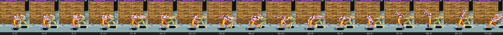
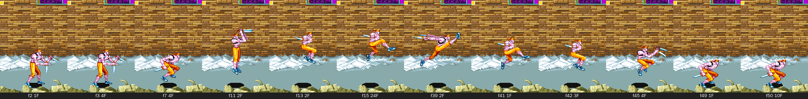
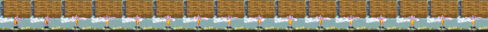

Weitere Streifen: `mack_gehen`, `mack_sprint`, `mack_sprung`,
`mack_sprungtritt_richtung`, `mack_sprungtritt_hoch`, `mack_sprungtritt_unten`,
`mack_sprintangriff`, `mack_griff_knie`, `mack_wurf`, `mack_getroffen`.

### Captain Commando

Weiß-blauer Anzug mit Visier; die Referenzfigur aller Messungen.

Geht in 12 Schritten zu 4 Frames, sprintet in 6 Schritten zu 4 Frames.
Kette: Gerade, Schlag, Ausfallschlag, hoher Drehtritt (3/4/5/10 LP).
Sprintangriff: langer flacher Rutschtritt. Spezialangriff (50 Frames):
duckt sich, schlägt auf den Boden, Blitze laufen nach beiden Seiten; der
getroffene Gegner blitzt als Röntgenskelett auf. Hält den Gegner am Kragen
in 24 px Höhe, 17 px vor sich; wirft ihn über den Kopf.

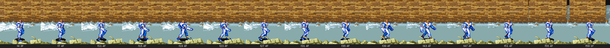
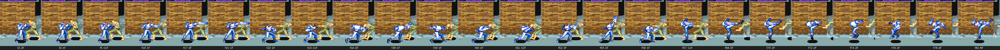
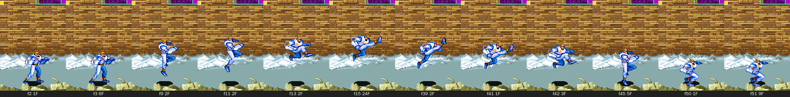
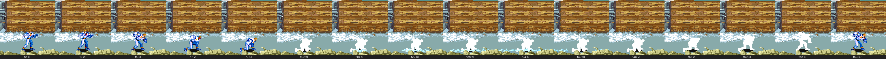
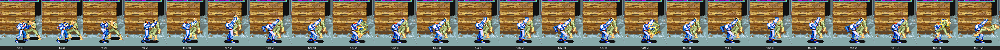
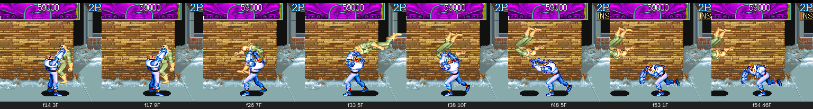
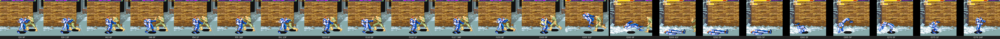

Weitere Streifen: `captain_stand`, `captain_sprint`, `captain_sprung`,
`captain_sprungtritt_richtung`, `captain_sprungtritt_hoch`,
`captain_sprungtritt_unten`, `captain_sprintangriff`.

### Ginzu the Ninja

Grau-schwarzer Ninja mit Schwert; in der Figurenwahl „NINJA COMMANDO“.

Geht und sprintet in Schritten zu 4 Frames. Kette: Schlag, Ellbogen,
Schwerthieb, springender Aufwärtshieb (3/4/5/9 LP). Hält den Gegner ohne
ihn anzuheben, 44 px vor sich. Wurf über die Schulter mit Überschlag,
12 LP, etwa 181 px weit; hoch + Angriff wirft nach vorn, runter + Angriff
ist ein eigener Wurf (14 LP, 173 px). Spezialangriff (41 Frames): Sprung
bis 51 px, Sternblitz, dann Rauchwolken.

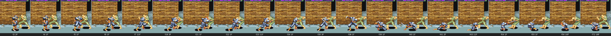
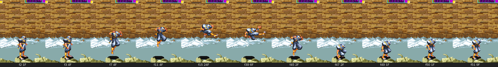
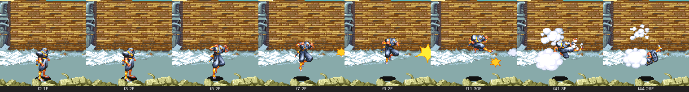

Weitere Streifen: `ginzu_stand`, `ginzu_gehen`, `ginzu_sprint`, `ginzu_sprung`,
`ginzu_sprungtritt_richtung`, `ginzu_sprungtritt_hoch`,
`ginzu_sprungtritt_unten`, `ginzu_sprintangriff`, `ginzu_griff_knie`,
`ginzu_wurf`, `ginzu_getroffen`.

### Baby Head

Baby in einem grünen Kampfroboter; in der Figurenwahl „BABY COMMANDO“.

Geht in Schritten zu 4 Frames, sprintet in Schritten zu 6 Frames. Jeder
Kettenschlag macht 6 LP; der Abschluss ist ein weit ausfahrender
Roboterarm. Hält den Gegner ohne Anheben, 30 px vor sich. Wurf mit Schwung,
12 LP, etwa 208 px weit. Als einzige Figur springt Baby Head mit dem
gegriffenen Gegner (bis 75 px hoch) und rammt ihn mit Angriff kopfüber in
den Boden (16 LP). Spezialangriff (46 Frames): der Roboter feuert eine
Rakete mit Feuerball.

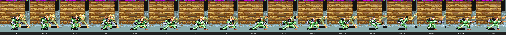
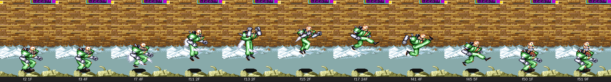
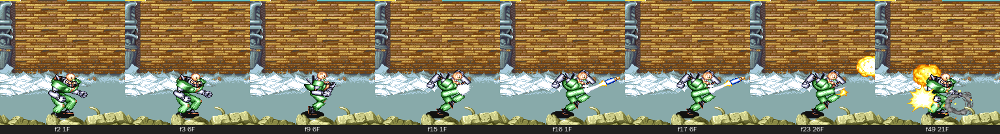

Weitere Streifen: `baby_stand`, `baby_gehen`, `baby_sprint`, `baby_sprung`,
`baby_sprungtritt_richtung`, `baby_sprungtritt_hoch`, `baby_sprungtritt_unten`,
`baby_sprintangriff`, `baby_griff_knie`, `baby_wurf`, `baby_getroffen`.

### Gemeinsame Bewegungen (Workflow, Gegenprüfung ausstehend)

| Bewegung | Werte |
|---|---|
| Sprint | Doppeltipp einer Richtung (erster Druck höchstens 10 Frames, Pause höchstens 10 Frames, zweiten Druck halten). In alle 8 Richtungen. x: 3,875 px/Frame, alle 6 Frames 0,125 weniger; nach genau 90 Frames geht die Figur wieder (266 px). Loslassen stoppt sofort |
| Sprintsprung | Sprung im Sprint: gleiche Flugbahn wie ein normaler Sprung nach vorn, nur eigene Animation |
| Sprintangriff | Angriff im Sprint: Rutschangriff über 41 px (3,5 px/Frame abnehmend), 23 Frames aktiv; Gesamtdauer Captain 35, Mack 39, Ginzu 38, Baby 31 Frames |
| Sprint-Sprungangriff | Angriff im Sprintsprung: eigener Angriff bis zur Landung |
| Spezialangriff | Angriff und Sprung im selben Frame; die Figur ist dabei geschützt. Kostet 9 LP, aber nur wenn er trifft; der Gegner verliert 6 LP |
| Umrisse im Stand (inkl. Schatten) | Mack 73 × 83, Captain 57 × 76, Ginzu 36 × 75, Baby Head 61 × 71 px |

## Gegner

Pose-Galerien je Stage und Gegnertyp in `gegner/` (Erzeugung läuft noch für die letzten Stages), Ablaufstreifen von WOOKY und EDDY: `gegner/wooky_*.png`, `gegner/eddy_*.png`.
